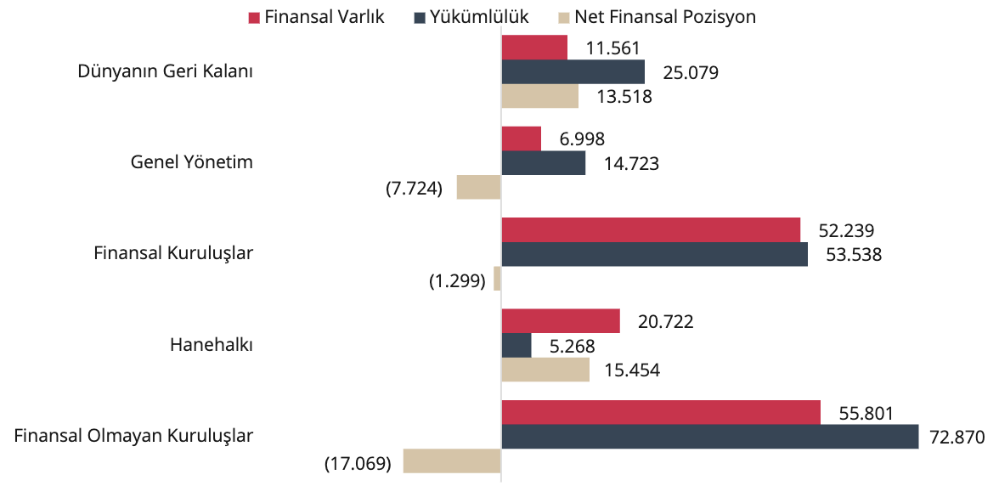

2025 1. Çeyrek Gelişmeleri- Özet

Sektörlere ilişkin finansal bilançolara göre, dönem sonu itibarıyla yurt içi yerleşik sektörlerin toplam finansal
varlıkları 136 trilyon TL, yükümlülükleri ise 146 trilyon TL düzeyinde gerçekleşmiştir. 2025 birinci çeyreği
itibarıyla gelişmeler aşağıda özetlenmektedir:

* Türkiye ekonomisinin net finansal pozisyon açığının gayri safi yurt içi hasılaya (GSYİH) oranı bir önceki
döneme göre 1,4 puan azalarak %22,8 seviyesinde gerçekleşmiştir.
* Sektörlerde gerçekleşen net finansal işlemler incelendiğinde, bir önceki çeyrekte GSYİH’nin %3,29’u
ile net borç alan konumunda olan toplam ekonomi, bu çeyrekte GSYİH’nin %5,82’si oranında net borç
alan konumundadır.

Grafik: Sektörler İtibarıyla Net Finansal Pozisyon, Stok (Milyar, TL)

Kaynak: TCMB

* Yurt içi ekonominin sektörel finansal bilançoları incelendiğinde, toplam ekonominin finansal borçlu
pozisyonunda olduğu, hanehalkı ve dünyanın geri kalanının yurt içi diğer sektörlerden alacaklı,
finansal olmayan kuruluşlar ve genel yönetimin ise diğer sektörlere borçlu pozisyonda olduğu
gözlenmiştir.
* Hanehalkı finansal varlıkları arasında para ve mevduat kalemi yaklaşık %60’lık pay ile öne çıkarken,
yükümlülüklerin tamamına yakını kredilerden oluşmaktadır.
* Finansal olmayan kuruluşların finansal varlıkları ve yükümlülükleri içinde sırasıyla %64 ve %50’lik pay
ile firmaların birbiri ile ticari işlemlerinden oluşan diğer alacaklar ve diğer borçlar kalemleri belirleyici
olmuştur.
* Tüm sektörlerin borçluluk oranları diğer ülkeler ile karşılaştırıldığında, Türkiye’de yerleşik sektörlerin
toplam borcunun düşük seviyede gerçekleştiği görülmektedir. Kredi ve borçlanma senetleri
niteliğindeki toplam borcun GSYİH’ye oranı 2025 yılının birinci çeyreğinde %93 oranında
gerçekleşerek önceki çeyreğe göre sınırlı artmıştır.