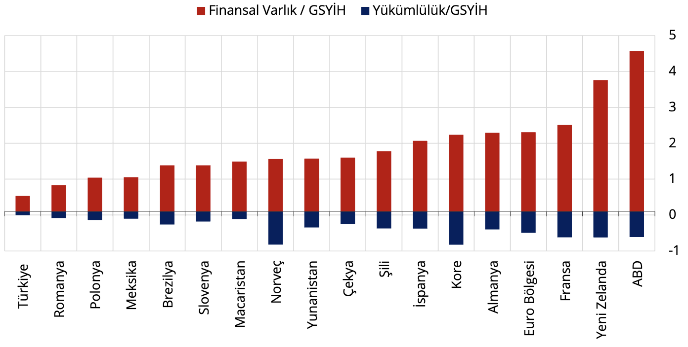
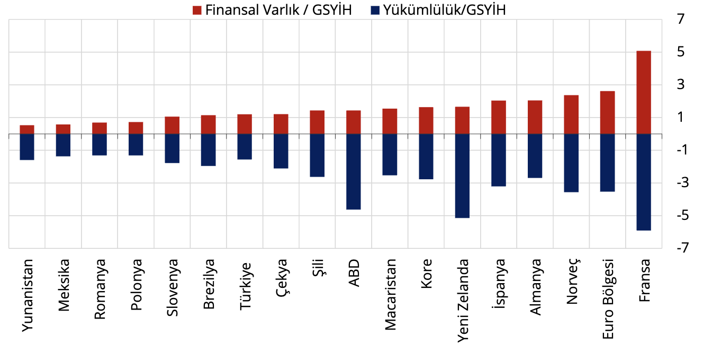

Hanehalkı finansal varlıklarının GSYİH’ye oranı 2025 yılı birinci çeyreği itibarıyla yaklaşık %44 seviyesindedir.
Eşdeğer gelişmekte olan ülkelerde söz konusu oran %74 (Romanya) ile %168 (Şili) arasında değişirken,
örnekleme dahil edilen gelişmiş ülkelerde ise bu oranın daha da yükseldiği görülmektedir. Hanehalkı
yükümlülüklerinin GSYİH’ye oranına bakıldığında ise; 2025 yılının birinci çeyreğinde Türkiye’nin %10 ile
karşılaştırma yapılan ülkeler arasında borçluluk düzeyi en düşük ülke olduğu görülmektedir (Grafik 33).

Grafik 33: Hanehalkı Ülke Karşılaştırması

Kaynak: TCMB, TÜİK, OECD

Son Gözlem: 2025-I

Dipnot: Diğer ülke verileri 2024 IV. Çeyrek itibarıyladır.

Finansal olmayan kuruluşların toplam finansal varlıklarının GSYİH’e oranı 2025 yılı birinci çeyreği
itibarıyla %120 seviyesindedir. Örnekleme alınan gelişmekte olan ülkeler arasında bu oranın %52 (Yunanistan)
ile %155 (Macaristan) arasında değiştiği görülmektedir. Yükümlülüklerin GSYİH’ye oranlarına bakıldığında ise;
Türkiye’nin %156 borçluluk oranı ile düşük ülkeler arasında yer aldığı görülmektedir (Grafik 34).

Grafik 34: Finansal Olmayan Kuruluşlar Ülke Karşılaştırması

Kaynak: TCMB, TÜİK, OECD

Son Gözlem:2025-I

Dipnot: Diğer ülke verileri 2024 IV. Çeyrek itibarıyladır.