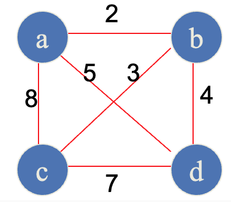

Örnek 1: Gezgin satıcı problemi 

Aralarındaki uzaklıklar verilen n şehir vardır. Her şehirde tam olarak 1 defa olmak ve harekete başlanan şehire geri dönmek koşuluyla en kısa tur yapılması istenmektedir. 
Çizge kuramı dilinde: Verilen bağlantılı ağırlıklı çizgede en kısa Hamilton devresini bulunuz. 
Örnek:

