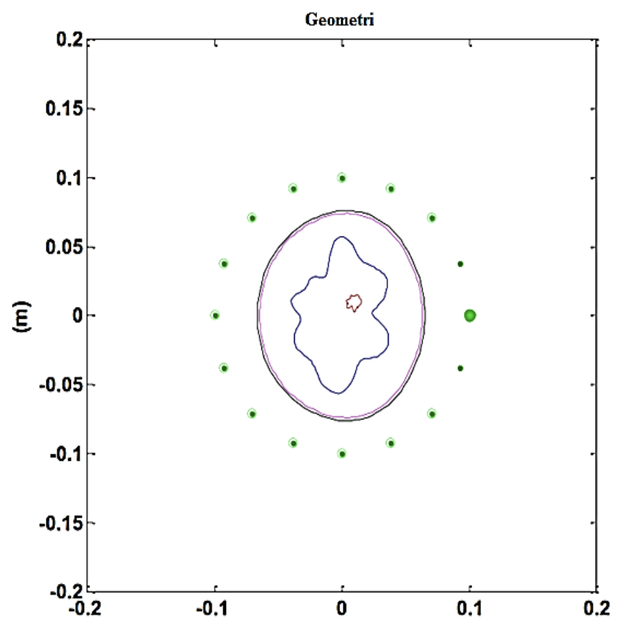

Şekil 2. En içten en dışa doğru katmanlar; tümör,
fibroglandular, yağ tabakası (adipose) ve
deri (skin). Bir anten, yayılımı yapan
anten ve diğerleri de alıcılardır [13].

Elektromanyetik alan bileşenleri Maxwell’in
denklemlerini sağlar ve her meme katmanındaki
radyasyon şartı kompleks dielektrik özellikleri ile
tanımlanır [13]. Meme tarafından saçılan alanlar
bu geometrinin fonksiyonlarıdır. Bu
elektromanyetik alanları elde etmek için sonlu
elemanlar ileri çözücüsü olarak COMSOL
Multifizik kullanılmıştır.

Çoklu-frekans inversiyon probleminde, frekansa
göre meme dokularının dielektrik özelliklerinin
belirlenmesi gerekmektedir. Bu çalışmada,
oluşturulan modele birinci dereceden veya ikinci
dereceden Debye formülasyonu geniş bir şekilde
uygulanmış [14] ve bu model ölçülen verinin
denklem katsayılarına adapte edilmiştir.
Birinci-dereceden Debye modeli aşağıdaki gibidir:

$$
\varepsilon_{rc}(\omega)
= \varepsilon_r(\omega)
+ i\,\frac{\sigma(\omega)}{\omega \varepsilon_0}
= \varepsilon_{\infty}
+ \frac{\varepsilon_s - \varepsilon_{\infty}}{1 - i\omega\tau}
+ i\,\frac{\sigma_s}{\omega \varepsilon_{0}}
\tag{1}
$$

$\varepsilon_{rc}$ bağıl kompleks dielektrik sabiti, $\omega$ açısal
frekans, $\varepsilon_{r}$ bağıl dielektrik sabiti, $\sigma$ iletkenlik, $\varepsilon_{0}$
boş-uzay dielektrik sabiti, $\varepsilon_{\infty}$ sonsuz frekansta
bağıl dielektrik sabiti, $\tau$ zaman sabiti (relaxation time constant) ve $\sigma_s$ statik iletkenliktir. Burada,
bağıl dielektrik ve iletkenlik aşağıdaki gibidir:

$$
\varepsilon_r(\omega)
= \varepsilon_{\infty}
+ \frac{\varepsilon_s}{1 + (\omega \tau)^2}
\tag{2}
$$

$$
\sigma(\omega)
= \omega^2 \tau \varepsilon_0
  \frac{\varepsilon_s - \varepsilon_{\infty}}{1 + (\omega \tau)^2}
+ \sigma_s
\tag{3}
$$

Meme katmanlarının ve tümörün birinci-dereceden
Debye formülasyonu için karakteristik
parametreleri Çizelge 2’de gösterilmiştir.

Çizelge 2. Birinci Dereceden Debye Parametreleri [13]

<table>
  <thead>
    <tr>
      <th>Katman</th>
      <th>$\varepsilon_{\infty}$</th>
      <th>$\varepsilon_s$</th>
      <th>$\sigma_s$</th>
    </tr>
  </thead>
  <tbody>
    <tr>
      <td>Deri (Skin)</td>
      <td>15.3</td>
      <td>40.1</td>
      <td>0.4</td>
    </tr>
    <tr>
      <td>Yağ (Adipose)</td>
      <td>3.18</td>
      <td>5.02</td>
      <td>0.043</td>
    </tr>
    <tr>
      <td>Fibroglandular</td>
      <td>16.8</td>
      <td>36.7</td>
      <td>0.461</td>
    </tr>
    <tr>
      <td>Tümör (Tumor)</td>
      <td>18.8</td>
      <td>46.8</td>
      <td>0.803</td>
    </tr>
  </tbody>
</table>

Şekil 2’de gösterilen meme katmanlarının
geometrisi MATLAB’da uygulanmış ve COMSOL
Multifizik programına aktarılmıştır. Bağıl
dielektrik ve iletkenlik fonksiyonları (2) ve (3)
nolu eşitliklerde olduğu gibi COMSOL’da analitik
olarak tanımlanmışlardır. Sonuç olarak;
MATLAB’da yazılan FDFD kodunun sonuçları ile
COMSOL’da üretilen sonuçlar karşılaştırılmıştır
ve nümerik sonuçlar elde edilmiştir.

Meme kanseri tedavisi için örnek bir meme
oluşturarak bunun dielektrik özelliklerinin
ölçümüyle ilgili bir çalışma yapılmıştır [15].
Birçok örnek modeller tümörün ve normal
dokunun belirgin tanımlarını içermezler. Bu
çalışma meme kanseri tedavisinde hipertermi için
Şekil 3’de gösterilen somut bir meme-tümör
örneği önermiştir. Bu somut meme ve tümör
örneklerinin nasıl yapıldığıyla ilgili ayrıntılı bilgi
ilgili çalışmada anlatılmıştır [15]. Ölçümler
dielektrik spektroskopi metodu kullanılarak elde
edilmiştir [10]. Dielektrik sabiti ve elektriksel
iletkenlik ölçümleri, E5071B ENA Series Network
Analyzer ve 85070 Dielectric Probe Kit
kullanılarak gerçekleştirilmiştir. Dielectric Kit