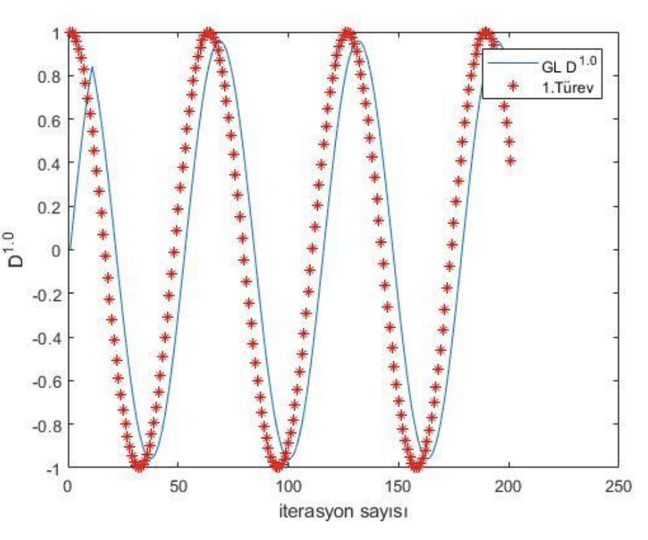
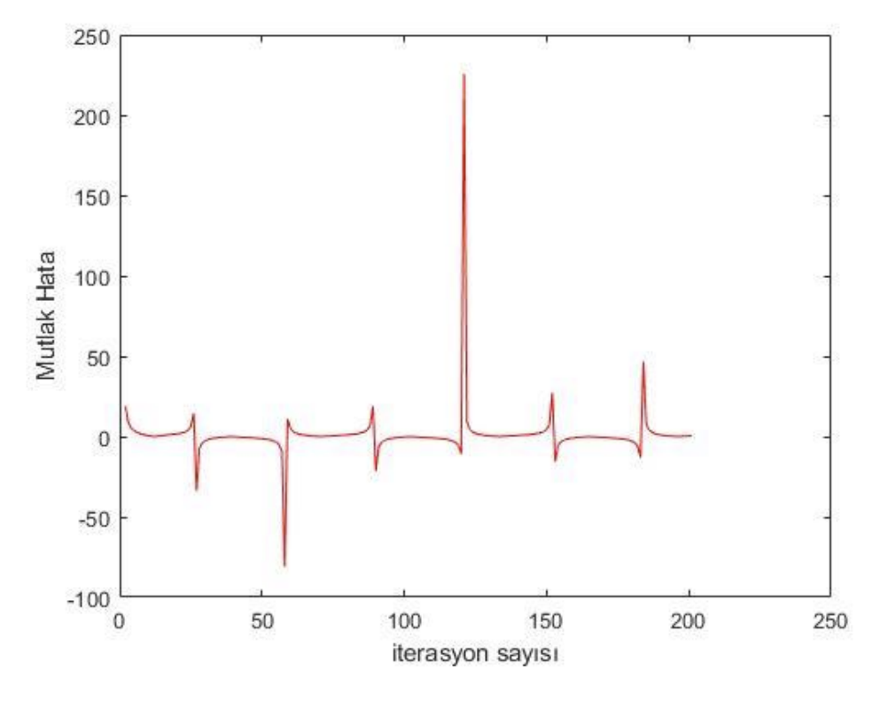

GL yöntemi kullanılarak $f(t) = \sin(t)$ fonksiyonunun $f'(t)$ sonucu ile karşılaştırılması Şekil 11'de, mutlak hata fonksiyonu
sonucu ise Şekil 12'de görsel olarak sunulmuştur.

Şekil 11. $f(t) = \sin(t)$ fonksiyonunun $D^{1.0} f(t)$ için GL sonucu ile $f'(t) = \cos(t)$ fonksiyonunun karşılaştırılması.

Şekil 12. $f(t) = \sin(t)$ fonksiyonunun $D^{1.0} f(t)$ için GL sonucu ile $f'(t) = \cos(t)$ arasında mutlak hata.