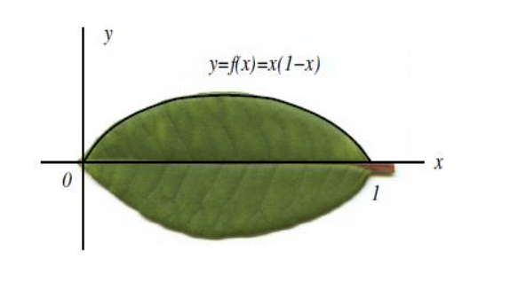

göstermiştir. De L’Hopital (1661-1704) ve Bernoulli ailesi, integral konusunda önemli
çalışmalara imza atmış; ancak karmaşık fonksiyonlar için integral kavramını
derinleştiren ve taşıyan isim Augustin-Louis Cauchy (1789-1857) olmuştur. Avrupa’da
sonsuz küçükler hesabı hızla ilerlerken, doğuda da 18. yüzyılda integraller üzerine
önemli çalışmalar yapılmıştır. Örneğin Mochinaga ve Ohashi 1687 yılında dairenin alanını
integral yöntemi ile hesaplamışlardır. Temelleri bu şekilde atılan integral hesabı, sonraki
yüzyıllarda büyük adımlarla ilerlemiş ve çok sayıda matematikçi bu alana katkı
sağlamıştır.

2. İntegral Hesabına Neden İhtiyaç Duyuldu?
İntegral hesabı ilk olarak, tüccarların, toprak sahiplerinin ve sıradan insanların günlük
olarak karşılaştıkları çok pratik sorunları çözmek için ortaya çıkmıştır. Örneğin düzensiz
bir şekle sahip olan yani basit bir geometrik şekle sahip olmayan toprak parçası için ne
kadar ödeme yapılmalı, alan hesabı nasıl yapılmalı ya da çeşitli şekillere sahip olan fıçılar
için bir fıçı zeytinyağı satın alırken aslında ne kadar zeytinyağı satın alınmaktaydı? Bu tür
soruların çoğunda, bir alanı veya hacmi doğru şekilde ölçme ihtiyacı, mevcut geometri
bilgilerinin çok ötesine geçmektedir [5] ve bu soruların cevaplanabilmesi için integral
hesabına ihtiyaç duyulmaktadır.
3. İntegral Nedir?
İntegral kelimesi dilimize Fransızca intѐgral kelimesinden geçmiştir. Bu kelimenin Türkçe
karşılığı ‘tümlev’ olup, bu kavram anlam açısından bakıldığında tümleme, bütünleştirme
gibi ifadelerle ilişkilidir. Matematiksel açıdan bakıldığında ise integral, bir büyüklüğü,
alanı hesaplanabilen küçük parçalara bölünmesi ve daha sonra oluşan her parçanın
toplanması ile elde edilen hesaplama şeklidir [6]. İntegral hesabı basit bir toplama işlemi
gibi görünse de bilimde çığır açmış bir matematiksel hesaplama yöntemidir. Bu yöntemi
doğadan bir örnekle açıklamak için aşağıdaki Resim 3.1. ile gösterilen yaprağın yüzey
alanı ele alınırsa;

Burada 0 ≤ 𝑥 ≤ 1 olmak üzere;

$$f(x) = x(1-x)$$

şeklinde basit bir parabol yaprağın üst kenarına uygun bir yaklaşım sağlar. Bu eğri ile x
ekseni arasında kalan alan, yaprağın alanının yarısıdır. Bu yaprağın x ekseni üzerinde
kalan kısmı Şekil 3.1. ile gösterildiği gibi 𝑁 tane dikdörtgensel bölgeye ayrıldığında;

