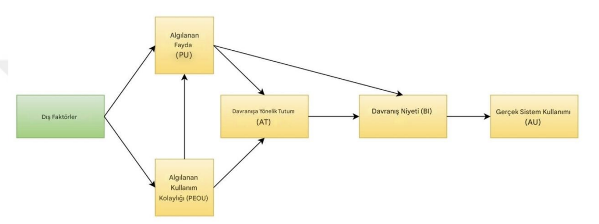

kararlarını açıklamak için algılanan fayda ve algılanan kullanım kolaylığı faktörlerine
odaklanır. Modelin temel basamakları şu şekilde özetlenebilir:
Teknolojik algılar → Kullanıcı tutumu → Kullanım niyeti → Gerçek kullanım
TAM, özellikle basit ve uygulanabilir yapısı nedeniyle çeşitli alanlarda geniş
bir uygulama alanı bulmuştur. Dış faktörlerin (örneğin, önceki deneyim, kolaylaştırıcı
koşullar) yeterince vurgulanmaması ve araştırmacı çalışmalarında zayıf varyans
sorunları yaşanması gibi durumlar modelin eleştirilmesine neden olmuştur.

Şekil 1: Teknoloji Kabul Modeli (Technology Acceptance Model – TAM) (47)

2.4.2. Genişletilmiş Teknoloji Kabul Modeli (TAM2 ve TAM3)
TAM modeli, zamanla genişletilerek TAM2 ve TAM3 gibi versiyon modeller
geliştirilmiştir. Bu genişletilmiş modeller, sosyal etkiler, bireysel farklılıklar ve
çevresel faktörler gibi ek değişkenleri içermektedir.
TAM2; Venkatesh ve Davis tarafından Teknoloji Kabul Modeli (TAM)
genişletilerek, algılanan yararlılığın belirleyicileri daha detaylı bir şekilde
incelenmiştir. Bu genişletilmiş model, TAM2 olarak adlandırılmakta olup, sosyal
etkiler (ör. normlar, başkalarının tavsiyeleri) ve bilişsel süreçler (ör. deneyim,
sonuçların gözlemlenmesi) teknoloji kabulünü etkileyen ek faktörler olarak modele
dahil edilmiştir (48).
TAM3, önceki TAM modellerini geliştirerek algılanan kullanım kolaylığını
daha ayrıntılı inceler. Model, bu kavramın yalnızca teknolojinin ne kadar kolay 

