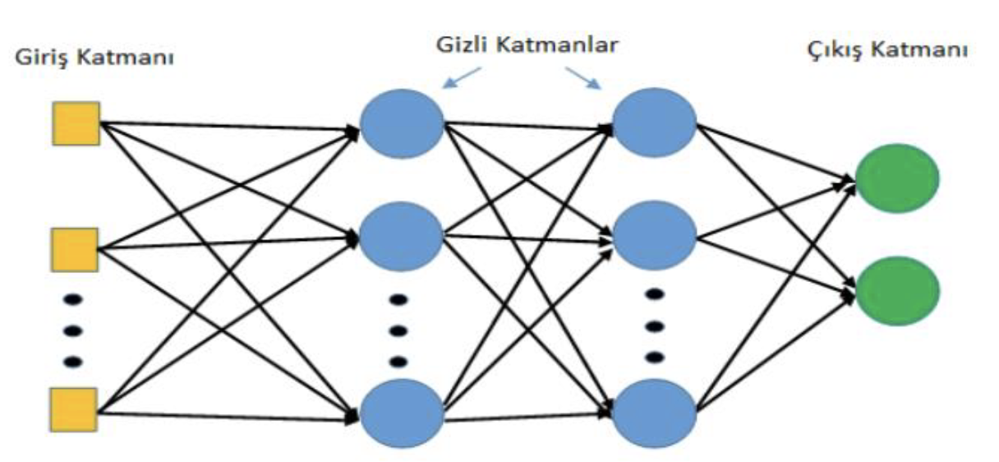

sayıda değişkenle çalışabilme gibi birçok önemli özelliğe sahiptir (Kırbaş, 2018). Şekil 7’de ileri beslemeli
çok katmanlı bir yapay sinir ağı yapısı verilmiştir (Şalvarcı, 2017).

Şekil 7. Çok katmanlı ileri beslemeli yapay sinir ağ yapısı

Figure 7. Multilayer feed forward neural network structure

Arıza yeri tahmininin YSA yaklaşımı ile belirlenmesi için ağa sunulacak olan veri kümesi görüntü
işleme tekniği kullanılarak elde edilen verilerdir. Modelin giriş parametreleri olarak görüntülerden elde
edilen sayısal veriler kullanılıp, çıktı olarak her görüntünün arıza yeri ‘D_Min_Max’ yöntemiyle
normalizasyon yapılarak kullanılmıştır. Böylelikle iletim hatlarında arıza yeri tespiti modeli, yapay sinir
ağları ile tahmin edilebilmektedir.

YSA çıkışları olarak literatürde yapılan normalizasyon çalışmaları ile ilgili değerlendirmeler
incelendiğinde ‘D_Min_Max’ Normalizasyon yönteminin uygun olduğu tespit edilmiştir.’ D_Min_Max’
normalizasyon yöntemi için Denklem 1 kullanılır (Yavuz ve Deveci, 2012).

$$
X' = 0.8 \cdot \frac{x_i - x_{\min}}{x_{\max} - x_{\min}} + 0.1
\tag{1}
$$

Bu eşitlikte; $X’$= Normalize edilmiş veriyi,

$X_i$= Giriş değeri,

$X_{min}$= Giriş seti içinde yer alan en küçük sayıyı,

$X_{max}$= Giriş seti içinde yer alan en büyük sayıyı

İfade etmektedir.

Tahmin etmeye ilişkin iki önemli adım bulunmaktadır; birincisi veriyi tahmin etmek için
hazırlamadır. İkincisi ise farklı tahmin edici modellerin karşılaştırılmasıdır. Modelleri karşılaştırma
ölçütleri; doğruluk, hız, sağlamlık, ölçeklenebilirlik, yorumlanabilirliktir. Yapay Sinir Ağları ve makine
öğrenmesi yöntemlerinin performans değerlendirmelerinde kullanılan temel performans göstergesi MSE
(mean square error) ve yüzde hata değeri kullanılmıştır. Denklem 2 ve Denklem 3’de sırasıyla yüzde
hata değeri, MSE hesaplamaları yer almaktadır. MSE ve yüzde hata değeri sıfıra yaklaşmasıyla hata
oranının azaldığını göstermektedir (Karasu ve diğ, 2018).

$$
\%\,Hata
=
\frac{\text{Gerçek arıza yeri} - \text{Hesaplanan arıza yeri}}
     {\text{Hattın toplam uzunluğu}}
\cdot 100
\tag{2}
$$

$$
MSE
=
\frac{1}{n}
\sum_{i=1}^{n}
(X_i - Y_i)^2
\tag{3}
$$

Bu eşitlikte;

$X_i$= Gerçek arıza yerini,

$Y_i$= Tahmin edilen arıza yerini

İfade etmektedir