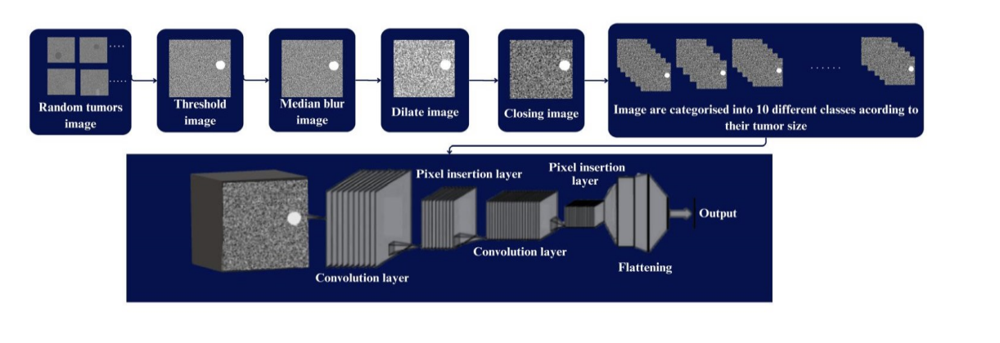

-Düzleştirme Katmanı (Flattening Layer): Matris verilerini tek sıralı girişlere
dönüştürerek klasik sinir ağı modelleri için hazırlar.
-Tam Bağlantılı Katman (Fully-Connected Layer): Öğrenme sürecini
kolaylaştırmak için ağırlıkları ve önyargıları ayarlar.

Şekil 3.2 Çalışmada kullanılan CNN modeli ve verisetinin akış şeması

Model, üretilen 1000 sentetik görüntüden oluşan veri seti üzerinde yinelemeli
olarak eğitilmiştir. CNN algoritmasının eğitimi sırasında gerekli hiperparametreler
optimize edilmiştir ve bu değerler Tablo 3.1'de sunulmaktadır. Modelin
genelleştirme yeteneğini değerlendirmek ve aşırı öğrenme (overfitting) sorunlarını
tespit etmek amacıyla, eğitilmiş model doğrulama ve test veri setleri üzerinde test
edilmiştir. Bu adımlar, modelin genel performansını ve genelleme kapasitesini
değerlendirmek açısından önemlidir.

Tablo 3.1 CNN modelinde optimize edilen hiperparametreler

<table>
  <thead>
    <tr>
      <th>Katman Adı</th>
      <th>Hiperparametreler</th>
    </tr>
  </thead>
  <tbody>
    <tr>
      <td>2D Convolution_1</td>
      <td>Number of filters: 32, Size of kernels: 3x3, Strides: 1x1, Activation: ReLU</td>
    </tr>
    <tr>
      <td>2D Convolution_2</td>
      <td>Number of filters 64, Size of kernels: 3x3, Strides: 1x1, Activation: ReLU</td>
    </tr>
    <tr>
      <td>2D Max_pooling</td>
      <td>Size of pooling: 2 x 2, Strides: 2x2</td>
    </tr>
  </tbody>
</table>