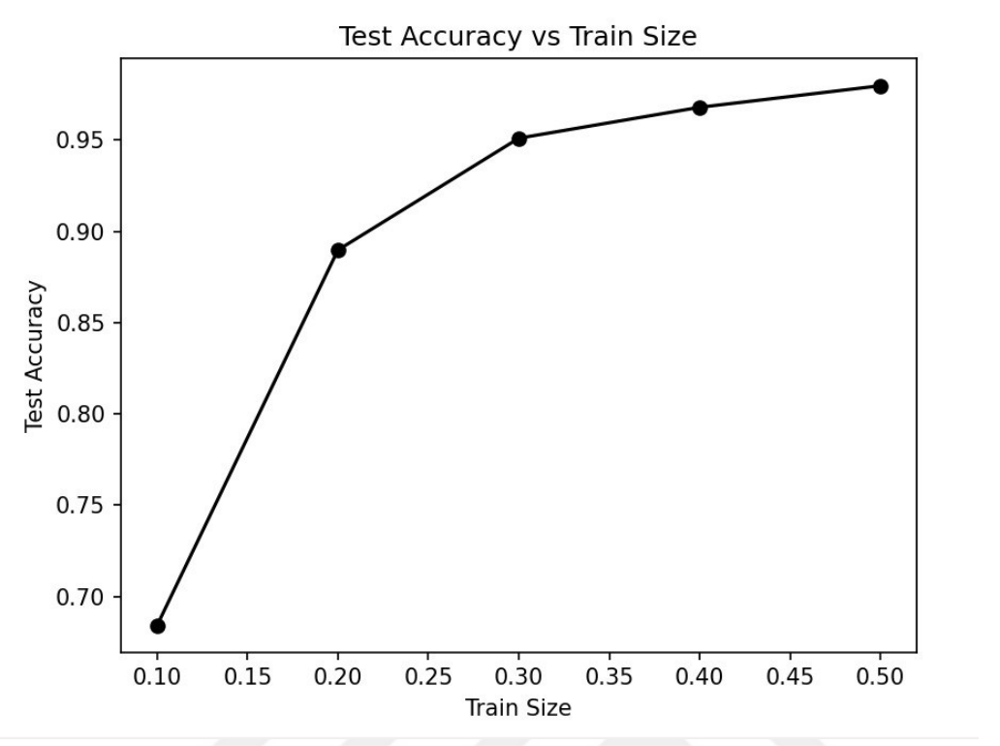

okunabilirliğini ve tutarlılığını bozabileceğinden bu yaklaşım tercih edilmiştir

Şekil 3.3 Eğitim seti boyutuna bağlı test verisinin başarı oranı

Şekil 3.3, modelin test veri setindeki performansının eğitim veri setinin boyutuna
göre nasıl değiştiğini göstermektedir. Bu grafik, modelin eğitim veri setinin
boyutuna duyarlı olduğunu ortaya koymaktadır. Eğitim verisi arttıkça modelin
performansı iyileşmekte, ancak bu iyileşme belirli bir noktadan sonra
durağanlaşmaktadır. Grafik, eğitim veri seti boyutunun 0.3 seviyesinden itibaren
tatmin edici sonuçlar verdiğini göstermektedir. 0.4 ve 0.5 eğitim seti boyutlarına
karşılık gelen test doğruluk değerlerinin birbirine oldukça yakın olduğu
gözlemlenmiştir. Bu durum, eğitim veri seti boyutunun 0.3 ile 0.5 arasında doyuma
ulaştığını göstermektedir. Daha önce belirtildiği gibi, toplamda 1000 sentetik USG 