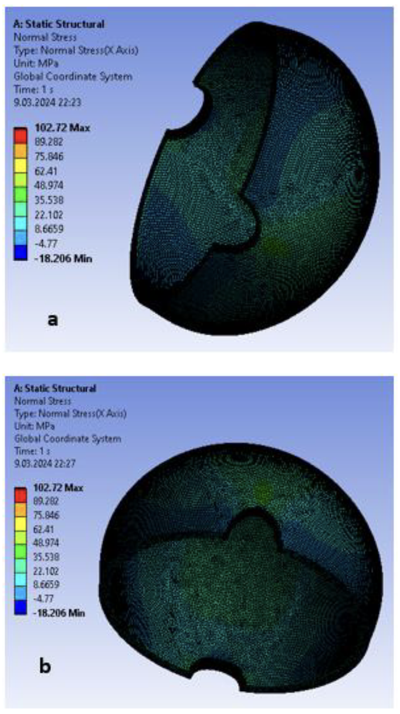
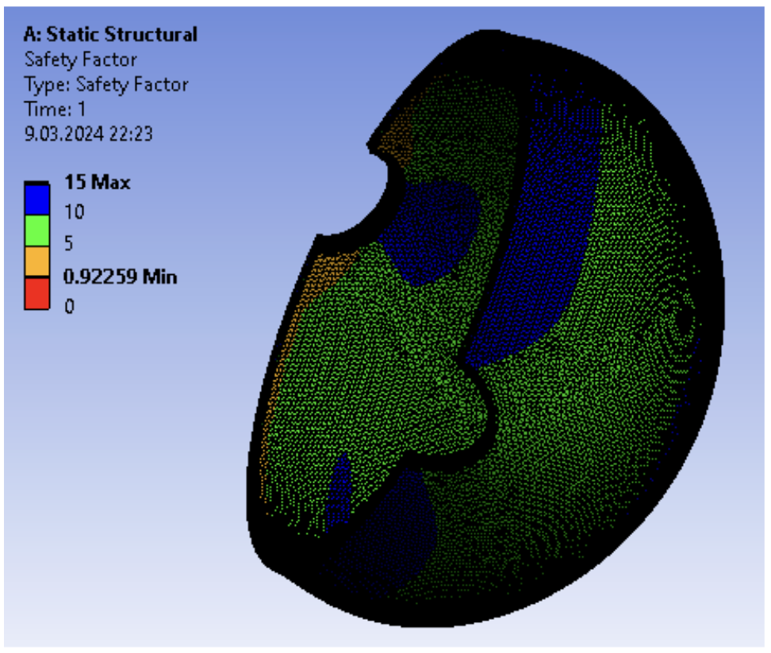
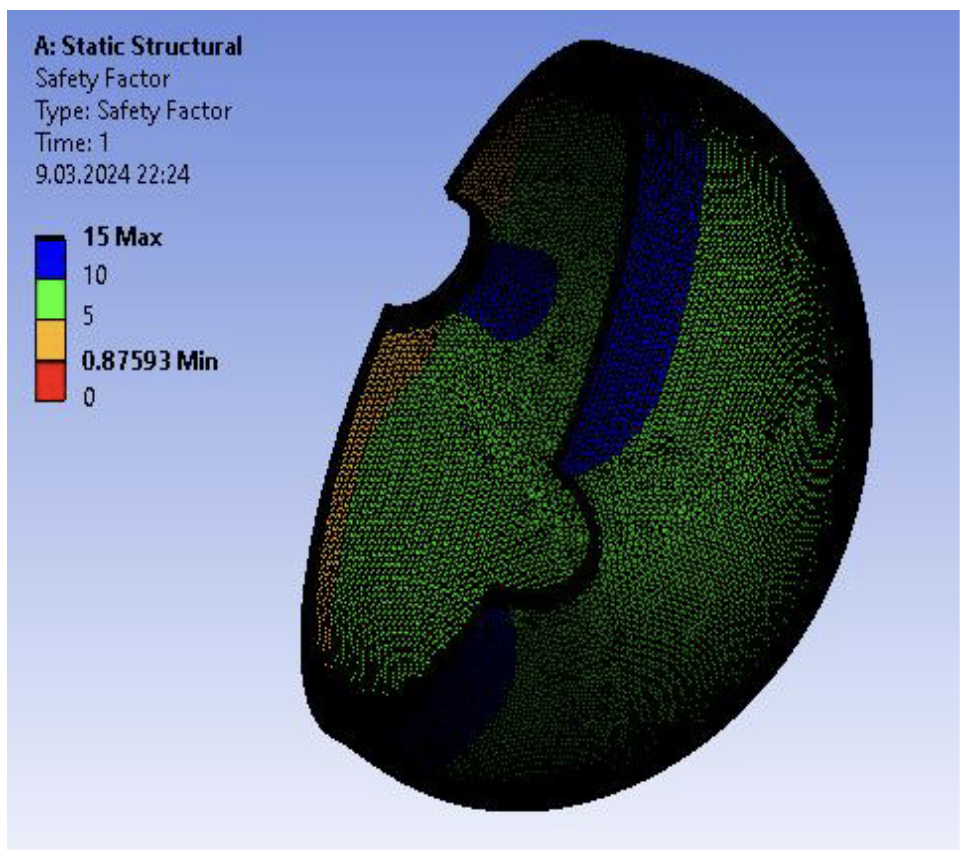
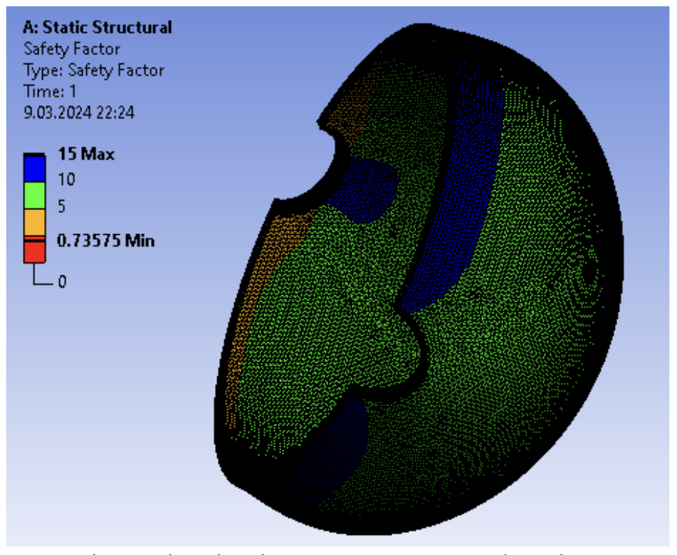

Şekil 8 a-b. İnce cidarlı eliptik delikli küresel elemanın Normal
Stress değeri (Normal Stress value of thin-walled
elliptical perforated spherical element)

Elde edilen sonuçlara göre 4 farklı yöntem için;
Maximum Equivalent Stress Theory, Maximum Shear
Stress Theory, Mohr- Columb Theory, Maximum
Tensile Stress Theory için ayrı ayrı emniyet katsayıları
bulunmuştur (Şekil 9-12).

Kırılma mekaniği teoremlerine göre malzeme üzerindeki
bileşke gerilme (σ; Asal gerilmeler, τ; Kayma
gerilmeleri) ve emniyet katsayıları aşağıdaki
denklemlerdeki gibi tanımlanır (Denklem 2-5):

* Maksimum Normal Gerilme Hipotezi:
$$
\sigma_B = \frac{1}{2}\left( \sigma + \sqrt{\sigma^2 + 4\tau^2} \right)
\tag{2}
$$
* Maksimum Şekil Değiştirme Hipotezi:
$$
\sigma_B = 0.35\sigma + 0.65\sqrt{\sigma^2 + 4\tau^2}
\tag{3}
$$
* Maksimum Şekil Değiştirme Hipotezi:
$$
\sigma_B = \sqrt{\sigma^2 + 4\tau^2}
\tag{4}
$$
* Maksimum Kayma Gerilmesi Hipotezi:
$$
\sigma_B = \sqrt{\sigma^2 + 3\tau^2}
\tag{5}
$$

Şekil 9. Maksimum Equivalent Stress Theory’ye göre emniyet
katsayısı (S) (Safety factor (S) according to Maximum
Equivalent Stress Theory)

Şekil 10. Maksimum Shear Stress Theory’ye göre emniyet
katsayısı (S) (Safety coefficient (S) according to
Maximum Shear Stress Theory)

Şekil 11. Mohr-Columb Theory’ye göre emniyet katsayısı (S)
(Safety factor (S) according to Mohr-Coulomb
Theory)