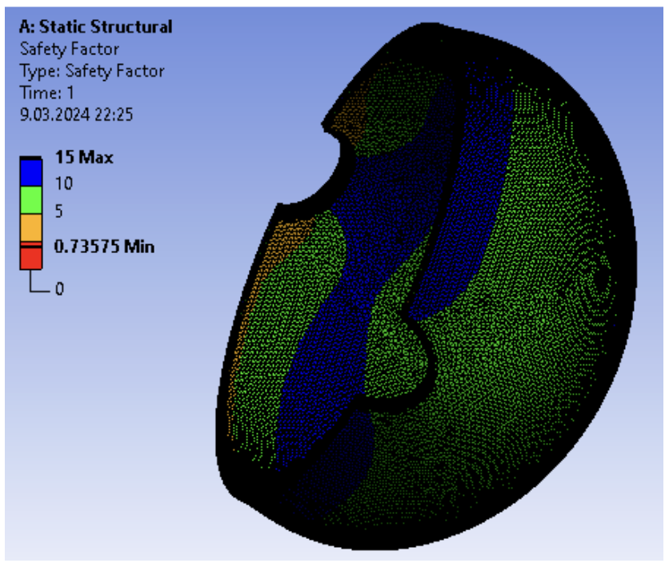
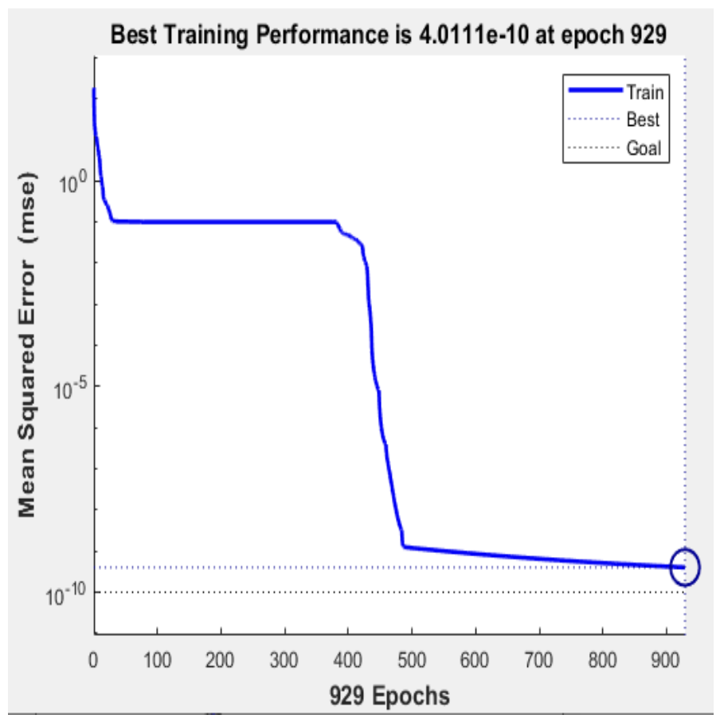
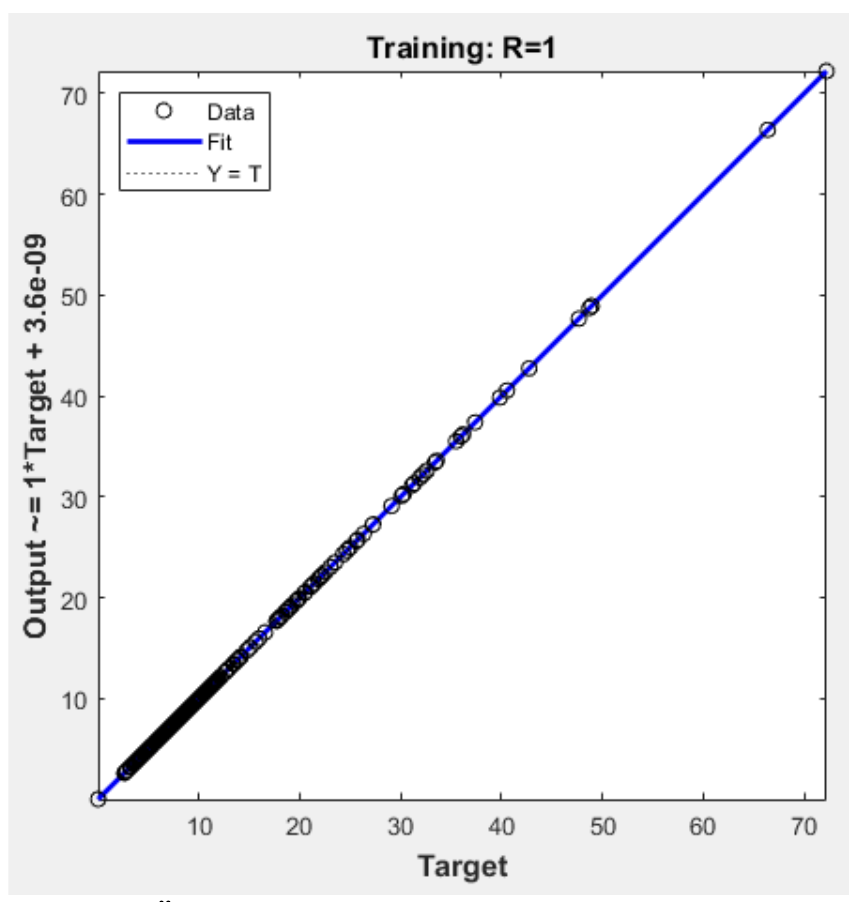

Şekil 12. Maksimum Tensile Stress Theory’ye göre emniyet
katsayısı (S) (Safety coefficient (S) according to
Maximum Tensile Stress Theory)

Yapay Sinir Ağları (YSA) Sonuçları

Gerçek YSA modelinin belirlenmesi için farklı
algoritmalarla denemeler yapılmış, hem eğitim (training)
hem de test performansı en yüksek değere sahip olan
YSA modeli belirlenmiştir. Çizelge 2’de çeşitli öğrenme
fonksiyonu, gizli katman sayıları ve nöron sayılarına
sahip YSA modelleri ve model performansları
verilmiştir.

10 Girdi+Gizli Katman 1 Tansig (13)+Gizli Katman 2
Tansig (15)+Gizli Katman 3 Logsig (27)+Gizli Katman
4 Purelin (9) ve 9 Çıktılı modelde elde edilen sonuçlar
aşağıda sırası ile verilmiştir. Şekil 13’de YSA modelinin
Best Traning performans değeri verilmiştir. Şekle göre
modelin en iyi öğrenme performansı 4.0111.E-10 olarak
929. Epoch’da elde edildiği görülmektedir. Modelin
öğrenme performansı R~1 olarak hesaplanmıştır (Şekil
14).

Çizelge 2. Farklı YSA modelleri ve performans değerleri
(Different ANN models and performance values)

<table>
  <thead>
    <tr>
      <th>Test No</th>
      <th>Net Adı</th>
      <th>Eğitim performans</th>
      <th>Test performans</th>
      <th>Eğitim Hatası</th>
      <th>Test Hatası</th>
      <th>Eğitim Algoritması</th>
      <th>Hata Fonk.</th>
      <th>Gizli katman Aktivasyon Fonk.</th>
      <th>Çıktı katman Aktivasyon Fonk.</th>
    </tr>
  </thead>
  <tbody>
    <tr>
      <td>1</td>
      <td>RBF 6-35-1</td>
      <td>-0.173001</td>
      <td>0.47628</td>
      <td>1.53E+12</td>
      <td>1.23E+11</td>
      <td>RBFT</td>
      <td>SOS</td>
      <td>Gaussian</td>
      <td>Identity</td>
    </tr>
    <tr>
      <td>2</td>
      <td>MLP 6-35-1</td>
      <td>0.950973</td>
      <td>0.970745</td>
      <td>3.30E-03</td>
      <td>4.80E-03</td>
      <td>BFGS 9</td>
      <td>SOS</td>
      <td>Identity</td>
      <td>Identity</td>
    </tr>
    <tr>
      <td>3</td>
      <td>MLP 6-35-1</td>
      <td>0.93528</td>
      <td>0.961201</td>
      <td>4.40E-03</td>
      <td>4.44E-03</td>
      <td>BFGS 7</td>
      <td>SOS</td>
      <td>Identity</td>
      <td>Tanh</td>
    </tr>
    <tr>
      <td>4</td>
      <td>MLP 6-35-1</td>
      <td>0.977747</td>
      <td>0.991454</td>
      <td>1.58E-03</td>
      <td>9.54E-04</td>
      <td>BFGS 9</td>
      <td>SOS</td>
      <td>Identity</td>
      <td>Logistic</td>
    </tr>
    <tr>
      <td>5</td>
      <td>MLP 6-35-1</td>
      <td>0.950781</td>
      <td>0.971731</td>
      <td>3.32E-03</td>
      <td>4.18E-03</td>
      <td>BFGS 9</td>
      <td>SOS</td>
      <td>Identity</td>
      <td>Sine</td>
    </tr>
    <tr>
      <td>6</td>
      <td>MLP 6-35-1</td>
      <td>0.950871</td>
      <td>0.969959</td>
      <td>3.31E-03</td>
      <td>4.95E-03</td>
      <td>BFGS 35</td>
      <td>SOS</td>
      <td>Sine</td>
      <td>Identity</td>
    </tr>
    <tr>
      <td>7</td>
      <td>MLP 6-35-1</td>
      <td>0.934904</td>
      <td>0.959152</td>
      <td>4.42E-03</td>
      <td>4.77E-03</td>
      <td>BFGS 7</td>
      <td>SOS</td>
      <td>Sine</td>
      <td>Tanh</td>
    </tr>
    <tr>
      <td>8</td>
      <td>MLP 6-35-1</td>
      <td>0.972084</td>
      <td>0.990051</td>
      <td>2.82E-03</td>
      <td>9.37E-04</td>
      <td>BFGS 5</td>
      <td>SOS</td>
      <td>Sine</td>
      <td>Logistic</td>
    </tr>
    <tr>
      <td>9</td>
      <td>MLP 6-35-1</td>
      <td>0.993797</td>
      <td>0.998625</td>
      <td>4.54E-04</td>
      <td>2.84E-04</td>
      <td>BFGS 8</td>
      <td>SOS</td>
      <td>Exponential</td>
      <td>Identity</td>
    </tr>
    <tr>
      <td>10</td>
      <td>MLP 6-35-1</td>
      <td>0.95013</td>
      <td>0.969395</td>
      <td>3.35E-03</td>
      <td>4.73E-03</td>
      <td>BFGS 22</td>
      <td>SOS</td>
      <td>Sine</td>
      <td>Sine</td>
    </tr>
  </tbody>
</table>

Şekil 13. En iyi öğrenme performansı (Best Training
performance)

Şekil 14. Öğrenme Performansı (Learning Performance)