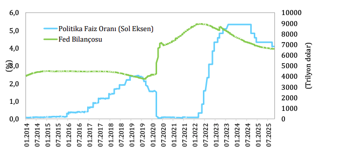

Şekil 3: Fed Bilançosu ve Politika Faiz Oranı

Kaynak: Bloomberg, FED
Avro Bölgesi’nde 2024 yılında ekonomik aktivite düşük hızda seyretmiş, ancak yılın ikinci yarısında
finansal koşullardaki gevşemenin etkisiyle toparlanma işaretleri ortaya çıkmıştır. Avrupa Merkez
Bankası (AMB), enflasyondaki düşüşün kalıcı hale gelmeye başlamasıyla birlikte Haziran 2024’te faiz
indirim döngüsüne girmiş; ana finansman oranını yüzde 4,25’e, mevduat oranını ise yüzde 3,75’e
düşürmüştür. Bu tarihten itibaren enflasyon oranlarındaki gerilemenin de sağladığı imkândan
yararlanılarak kademeli faiz indirimleriyle 2025 yılının Haziran ayına kadar olan dönemde toplamda
210 baz puan faiz indirimi gerçekleştirilmiştir. Bu politika değişikliği kredi koşullarını gevşetmiş ve
2025 yılı başında sanayi üretiminde kısmi toparlanmayı desteklemiştir. Bu dönemde tarife artışlarına
ilişkin belirsizliğin tetiklediği ABD’nin öne çekilen talebi de bölge ülkelerinde ekonomik aktiviteyi
desteklemiştir. IMF tahminlerine göre 2024 yılında yüzde 0,9 oranında büyüme kaydeden Avro
Bölgesi ekonomisinin, 2025 yılında yüzde 1,2 ve 2026 yılında yüzde 1,1 oranında büyümesi
beklenmektedir.