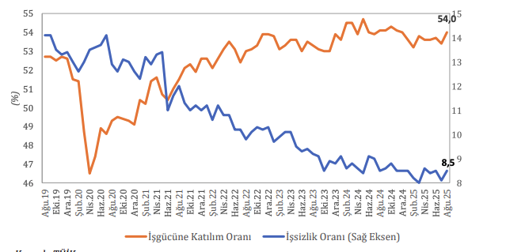

Mevsim etkilerinden arındırılmış işsizlik oranı düşük seyrini sürdürmüş ve 2025 yılının Ağustos
ayında yüzde 8,5 olarak gerçekleşmiştir. İşgücüne katılım oranı önceki aya göre 0,6 puan artarak
yüzde 54 olurken, bu dönemde istihdamdaki 208 bin kişilik artışa rağmen işsizlik oranı 0,4 puan sınırlı
bir yükseliş göstermiştir (Şekil 2).
Şekil 2: İşsizlik ve İşgücüne Katılım Oranı (MEA)

Kaynak: TÜİK
Tablo 1: İşgücü Göstergeleri
<table>
  <thead>
    <tr class="header-row">
      <th style="text-align: left;"></th>
      <th>Ağustos 2024</th>
      <th>Ağustos 2025</th>
      <th>Yıllık Fark</th>
    </tr>
  </thead>
  <tbody>
    <tr>
      <td class="item-col">Çalışma Çağı Nüfusu (Bin Kişi)</td>
      <td>65.979</td>
      <td>66.458</td>
      <td>479</td>
    </tr>
    <tr>
      <td class="item-col">İşgücü (Bin Kişi)</td>
      <td>36.251</td>
      <td>36.526</td>
      <td>275</td>
    </tr>
    <tr>
      <td class="item-col">İşgücüne Katılım Oranı (%)</td>
      <td>54,9</td>
      <td>55,0</td>
      <td>0,1</td>
    </tr>
    <tr>
      <td class="item-col">Toplam İstihdam (Bin Kişi)</td>
      <td>33.164</td>
      <td>33.420</td>
      <td>256</td>
    </tr>
    <tr>
      <td class="item-col">İstihdam Oranı (%)</td>
      <td>50,3</td>
      <td>50,3</td>
      <td>0,0</td>
    </tr>
    <tr>
      <td class="item-col">İşsiz Sayısı (Bin Kişi)</td>
      <td>3.087</td>
      <td>3.106</td>
      <td>19</td>
    </tr>
    <tr>
      <td class="item-col">İşsizlik Oranı (%)</td>
      <td>8,5</td>
      <td>8,5</td>
      <td>0,0</td>
    </tr>
    <tr>
      <td class="item-col">Genç İşsizlik Oranı (%)</td>
      <td>15,8</td>
      <td>16,4</td>
      <td>0,6</td>
    </tr>
  </tbody>
</table>