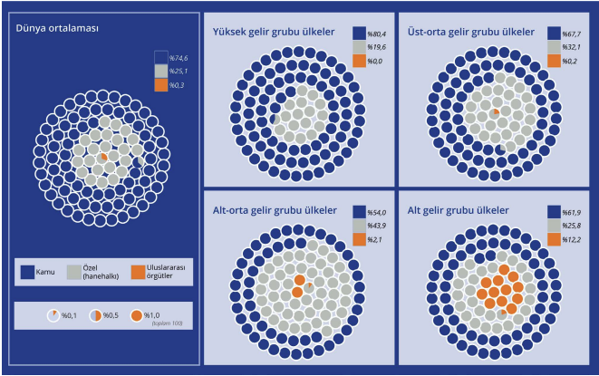

1. Eğitime Ayrılan Kamu
Kaynaklarının Önemi

Eğitime ayrılan kaynaklar genel olarak kamu
ve kamu dışı olmak üzere iki ana grupta
sınıflandırılabilir. Kamu kaynakları, merkezi ve yerel
yönetim bütçelerinden sağlanan, resmî okullardaki
öğretmen maaşlarından okul binalarına, öğretim
programı geliştirmeden ölçme-değerlendirme
sistemlerine kadar tüm harcama kalemlerini
kapsar. Kamu dışı kaynaklar ise hanehalkı ve özel
sektör harcamaları ile uluslararası örgütlerden
gelen kalkınma yardımları gibi desteklerden
oluşur.

1980’den beri küresel ölçekte yapısal uyum
politikaları ve düşük ücretli özel öğretim kurumu
modelleri gibi uygulamalarla eğitim harcamalarında
kamu kaynaklarının azaltılması teşvik edildi. Ancak
hâlâ, sadece Türkiye’nin de bulunduğu üst-orta
gelir grubu ülkelerde değil, tüm dünyada eğitim
hizmetlerinin finansmanında en büyük pay kamuya
aittir (Şekil 1). Diğer yandan bu pay her ülkede
eşit düzeyde değildir, ülkelerin gelir gruplarına
göre farklılaştığı görülüyor: Finlandiya, Kanada,
Japonya gibi yüksek gelir grubundaki ülkelerde
eğitim harcamalarının %80,4’ü kamu tarafından
yapılırken; Nijerya, Endonezya, Guatemala gibi
alt-orta gelir grubu ülkelerde bu oran %54,0’dır.
Ayrıca Şekil 1’de eğitim harcamalarında kamunun
payının yalnızca yüksek gelirli ülkelerde dünya
ortalamasının üstünde olduğu görülüyor. 

Kaynak: World Bank ve UNESCO (2025) verileri kullanılarak yazar tarafından hazırlandı.
Şekil 1 - Ülkelerin gelir gruplarına göre eğitim harcamalarının finansman kaynaklarına göre dağılımı, 2022