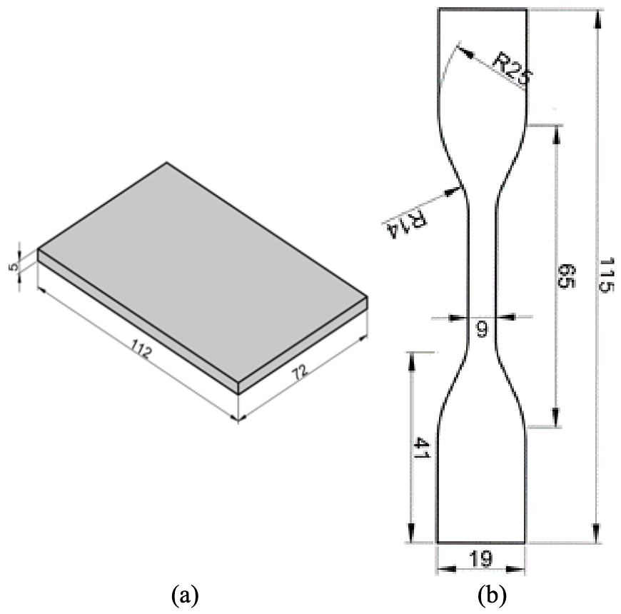

Tablo 1. Literatürden SKK yöntemi kullanılarak birleştirilen malzeme ve işlem parametreleri

<table>
  <thead>
    <tr>
      <th>Malzeme</th>
      <th>Takım ilerleme hızı (mm/dk)</th>
      <th>Takım dönme hızı (dev/dk)</th>
      <th>Karıştırıcı uç geometrisi</th>
    </tr>
  </thead>
  <tbody>
    <tr><td>HDPE [11]</td><td>45, 75, 115</td><td>1500, 2000, 3000</td><td>Silindirik</td></tr>
    <tr><td>HDPE [12]</td><td>15</td><td>1200–2000</td><td>Silindirik</td></tr>
    <tr><td>PLA [13]</td><td>20, 30, 40</td><td>700, 1400, 2000</td><td>Silindirik, vida ve konik</td></tr>
    <tr><td>PLA/Al [14]</td><td>20, 30, 40</td><td>800, 1100, 1400</td><td>Silindirik</td></tr>
    <tr><td>PLA [15]</td><td>10, 14, 20</td><td>800, 1400, 2000</td><td>Konik pin</td></tr>
    <tr><td>PLA [16]</td><td>3, 6, 9</td><td>600, 1000, 1400</td><td>Kesik koni ve silindirik</td></tr>
    <tr><td>PE [17]</td><td>16, 29, 44</td><td>900, 1280, 1700</td><td>Vida M10, M12, M14</td></tr>
    <tr><td>HDPE [18]</td><td>20, 40, 63</td><td>500, 710, 1000, 1400, 2000</td><td>Silindirik</td></tr>
    <tr><td>PE-PP [19]</td><td>8, 10, 12.5</td><td>900, 1860, 2920</td><td>Vida, kare, üçgen, düz ve silindir</td></tr>
    <tr><td>PP [20]</td><td>8</td><td>2000</td><td>Kare, konik vida, dört ağızlı vida</td></tr>
  </tbody>
</table>

2.1 Filament malzemeleri

3B yazıcılarda sarf malzemeleri olarak genel kullanım
amacıyla PLA (polilaktik asit), ABS, PETG gibi filamentler,
mühendislik işleri veya daha özel sektörlerin kullanımı için
ise farklı çeşitlerde kompozit filamentler bulunmaktadır.

PLA; hem filamenti oluşturan ana malzeme olarak hem
de içerisine dolgu eklenmesi sayesinde geliştirilebilir olması
sebebiyle çok tüketilen bir malzemedir. PLA filamentler;
düşük sıcaklıklarda basılması, tabla ısıtmasına ihtiyaç
duyulmaması ve baskı sırasında oluşabilecek hataların azlığı
nedeniyle tercih edilmektedirler. PLA; mısır, patates, şeker
kamışı vb. yenilebilir kaynaklardan üretilebilen organik bir
malzeme olduğu için insan sağlığına zararsızdır ve belli
şartlarda doğada ayrışabilen biyopolimerlerdendir [21-23].
Bu özelliklerinden dolayı petrol bazlı polimerlere
(polipropilen (PP), düşük yoğunluklu polietilen (LDPE),
polistiren (PS) ve poliamid (PA)) alternatif olarak
kullanılmaktadır [24, 25]. PLA filamentler, farklı
uygulamalarda kullanılabilmesi için çeşitli dolgu
malzemeleri eklenerek modifiye edilmektedir. Eklemeli
imalatta sarf malzeme olarak kullanılan filamentlerin
çeşitleri her geçen gün artmaktadır. SKK metodunda kaynak
kalitesini etkileyen fazla sayıda parametre olduğu ve eklenen
her parametre ciddi sayıda deney sayısını arttırdığı için
yapılan çalışma malzeme olarak PLA-CF ve PLA Wood ile
sınırlandırılmıştır. Bu çalışmada, karbon fiber katkılı PLA
(PLA-CF) ve ahşap katkılı PLA (PLA Wood) olmak üzere
iki kompozit termoplastik filament kullanılmıştır. PLA-CF
filament, karbon lif takviyeli (%15) PLA kompozit
filamenttir. Ana matris içinde yer alan karbon lifler
kristalleşmeyi iyileştirerek sade PLA’ya kıyasla daha iyi
mekanik ve termal özellikler göstermesine olanak
sağlamaktadır [22, 26]. PLA Wood ise, %30 oranında ağaç
lifi (çam, sedir, bambu, meşe ve zeytin vb.) içeren kompozit
PLA filamenttir. Düşük mukavemetine rağmen doğal
görünümü ve ahşap hissi vermesinden dolayı özellikle
görselliğin önemli olduğu mimari ve ev dekorasyon
modelleri ürünlerinde tercih edilmektedir [27]. PLA-CF ve
PLA Wood filamentlerin özellikleri Tablo 2’de verilmiştir.

Tablo 2. Filamentlerin teknik özellikleri

<table>
  <thead>
    <tr>
      <th>Mekanik Özellikler</th>
      <th>PLA-CF [28]</th>
      <th>PLA-Wood [29]</th>
    </tr>
  </thead>
  <tbody>
    <tr><td>Çap ölçüsü (mm)</td><td>1.75</td><td>1.75</td></tr>
    <tr><td>Marka</td><td>Filameon</td><td>Filameon</td></tr>
    <tr><td>Renk</td><td>Siyah</td><td>Açık Kahverengi</td></tr>
    <tr><td>Çekme Mukavemeti (MPa)</td><td>55</td><td>47</td></tr>
    <tr><td>Yoğunluk (g/cm³)</td><td>1.23</td><td>1.13</td></tr>
  </tbody>
</table>

2.2 Deney numunelerinin üretimi

Deneylerde, eriyik yığma modelleme prensibi ile çalışan
Ender 3-S1 3B yazıcı kullanılarak SKK için 72x114x5 mm
ölçülerinde plakalar (Şekil 2a) ve filamentlerin mekanik
özelliklerinin belirlenmesi için ASTM D638-10 [30]
standartlarına uygun numuneler (Şekil 2b) basılmıştır. PLA-
CF ve PLA Wood numunelerin baskı parametreleri sırasıyla;
nozul sıcaklığı 215/220 oC, tabla sıcaklığı 65/65 oC, basım
hızı 45/50 mm/sn ve basım yönü XYZ olarak kullanılmıştır.
Numuneler, katman kalınlığı 0.2 mm ve %100 doluluk
oranında basılmıştır. Her malzeme için 5 adet çekme
numunesi basılarak çekme mukavemetlerinin ortalaması
alınmıştır.

Şekil 2. SKK kaynağı plaka ve çekme numune ölçüleri
(mm)

2.3 Sürtünme karıştırma kaynağı işlemleri

SKK yönteminde malzeme çiftlerinin birleştirilmesinde
kaynak kalitesi işlem parametrelerinden doğrudan
etkilenmektedir. Kaynak kalitesini etkileyen başlıca işlem
parametreleri takım ilerleme hızı [31], takım dönme hızı [32-
34], takım omuz şekli [35], karıştırıcı uç geometrisi [36, 37]
ve eğim açısı [38] olarak sıralanabilir. İşlem parametreleri
kaynak bölgesinde sürtünmeden kaynaklı üretilen ısı miktarı