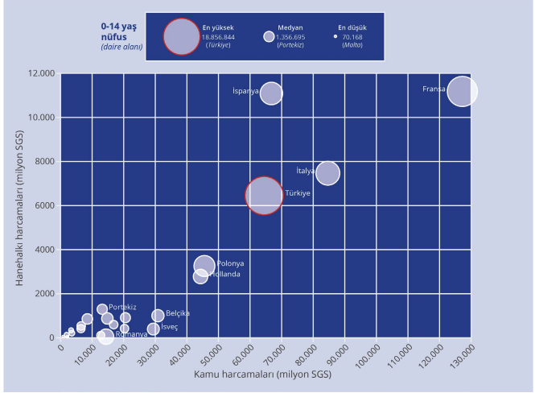

sayılabilir. Dolayısıyla hanehalkı harcamaları arttıkça
eğitimdeki sosyoekonomik farklar derinleşir.,

Ülkeler arasında eğitim harcamalarındaki hanehalkı
katkısını izlemenin bir yolu da satın alma gücü
standardına (SGS) göre hanehalkı harcama
miktarlarını karşılaştırmaktır. Harcamaları izlemek
için kullanılan yapay bir para birimi olan SGS,
Eurostat gibi izleme yapan kurumlar tarafından
hesaplanır. 1 SGS, her ülkede aynı miktarda mal ve
hizmet satın alabilecek eşdeğer alım gücünü temsil
eder. Hanehalkı tarafından yapılan toplam harcama,
nüfusun büyüklüğü ve yaşa göre nüfus dağılımı
gibi demografik verilerden etkilenir. Bu nedenle
analizler sadece harcama tutarına değil, nüfus ve
kamu harcamalarının düzeyi gibi diğer göstergelere
de bakılarak yapılmalıdır.

2022 yılına göre karşılaştırmalı analiz yapılabilecek
veri sağlanan 24 ülkede hanehalkı harcamaları
incelendiğinde, Türkiye’nin yaklaşık 7,5 milyar SGS
harcama yaptığı görülüyor. Bu miktar ile Türkiye,
Fransa (yaklaşık 12 milyar), İspanya (yaklaşık 11,2
milyar) ve İtalya’dan (yaklaşık 11,1 milyar) sonra
en yüksek hanehalkı eğitim harcamasına sahip
ülkelerden biridir (Şekil 3). Ancak bu grupta Türkiye,
0-14 yaş çocuk nüfusunun en yüksek olduğu ülkedir
ve bu nüfusun büyüklüğü düşünüldüğünde kamu
tarafından ayrılan kaynaklar oldukça düşüktür (Şekil
3). Örneğin, İspanya’daki 0-14 yaş nüfus Türkiye’nin 

Kaynak: Eurostat (2024) ve World Bank (t.y.) verileri kullanılarak yazar tarafından hazırlanmıştır.
Şekil 3 - Kamu ve hanehalkı eğitim harcamaları ile 0-14 yaş çocuk nüfusu ili̇ şkisi̇ , 2022
Not: Yuvarlakların büyüklükleri 0-14 yaş nüfusu göstermektedir.