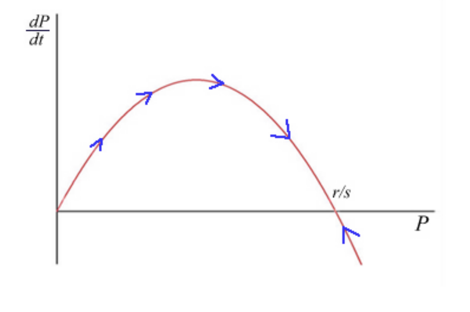

$$\frac{dP}{dt} = (r - sP)P$$

Şekil: Lojistik denklemin faz düzlemi

Parabol kesim noktaları $P = 0$ ve $P = r/s$

$(0, r/s)$ de $dP/dt > 0$; ($t \to 0$ için $P(t)$ artarak $r/s$ ye yaklaşır)

$(r/s, \infty)$ da $dP/dt < 0$ ($t \to 0$ için $P(t)$ azalarak $r/s$ ye yaklaşır)
