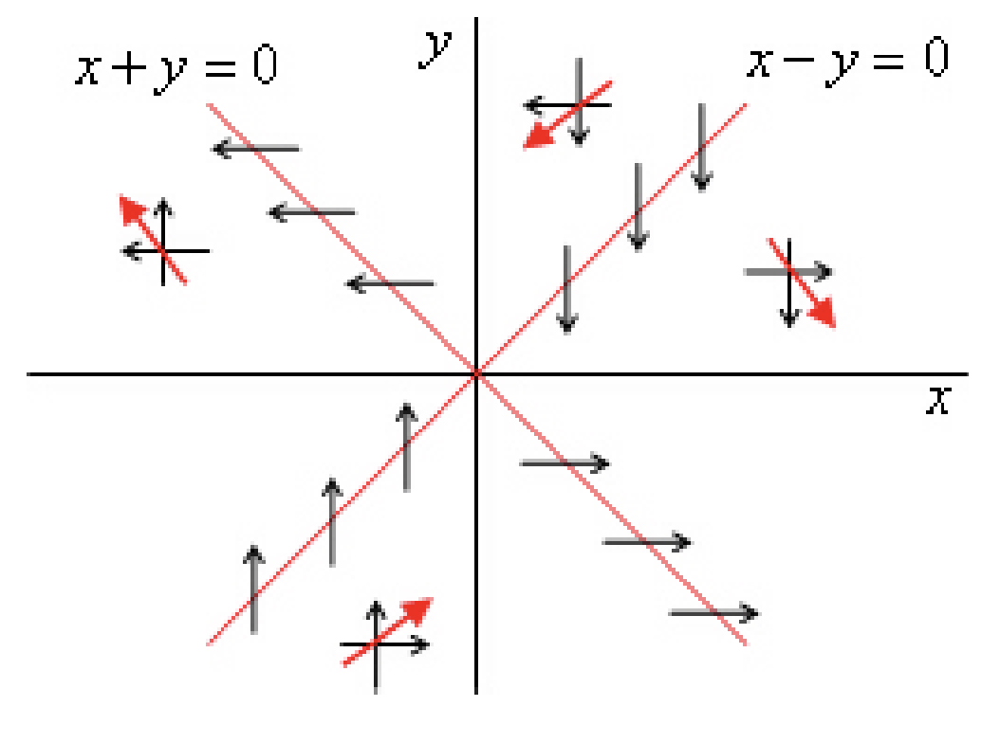

$$\left\{ \frac{dx}{dt} = x - y, \quad \frac{dy}{dt} = -2x - 2y \right\}$$
sistemini göz önüne alalım.

$p = a + d = -1$, $q = ad - bc = -4$, $\Delta = p^2 - 4q = 17$ olup, $\Delta > 0$ ve $q < 0$ olduğundan semer noktası vardır. 
Faz düzlem denklemi
$$\frac{dy}{dx} = \frac{-2(x + y)}{x - y}$$
olduğundan eşyönlüler: $x - y = 0$ ve $x + y = 0$ doğrularıdır.

Şekil: Eşyönlüler (oklar zamana baglı denklemden alınmıştır).

