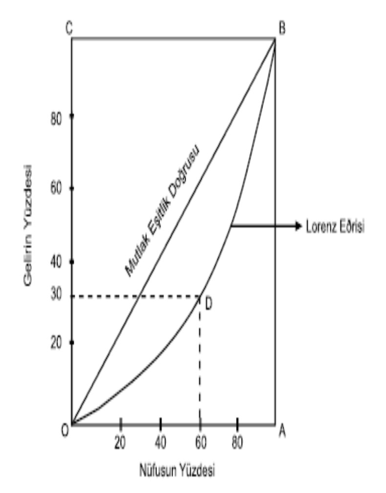

Lorenz eğrisi

Eğer bir ülkede kişisel gelir dağılımı
mutlak bir eşitlik yaratacak şekilde
gerçekleşmişse iki köşeyi birleştiren
diyagonal doğru biçiminde olacaktır.

Ancak bir ülkede gelir dağılımında bir
eşitsizlik varsa, mutlak eşitlik
doğrusundan uzaklaşma başlar ve
Lorenz eğrisi çukurlaşır. Lorenz eğrisi
mutlak eşitlik doğrusuna ne kadar
yakın olursa gelir dağılımında o kadar
az, mutlak eşitlik doğrusuna ne kadar
uzak ise gelir dağılımında o kadar çok
eşitsizlik var demektir.

