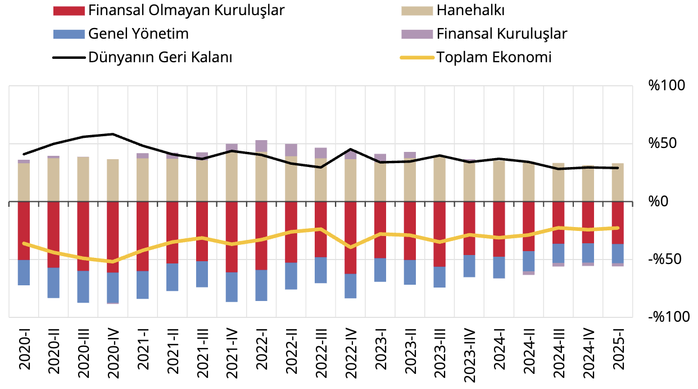

I. Genel Değerlendirme

Tablo 1: Net Finansal Pozisyonun Sektörler İtibarıyla Dağılımı (Milyar TL)1

<table>
  <thead>
    <tr>
      <th></th>
      <th>Toplam Ekonomi</th>
      <th>Finansal Olmayan Kuruluşlar</th>
      <th>Finansal Kuruluşlar</th>
      <th>Genel Yönetim</th>
      <th>Hanehalkı</th>
      <th>Dünyanın Geri Kalanı</th>
    </tr>
  </thead>
  <tbody>
    <tr>
      <th>Finansal Varlıklar</th>
      <td>135.760</td>
      <td>55.801</td>
      <td>52.239</td>
      <td>6.998</td>
      <td>20.722</td>
      <td>11.561</td>
    </tr>
    <tr>
      <th>Yükümlülükler</th>
      <td>146.399</td>
      <td>72.870</td>
      <td>53.538</td>
      <td>14.723</td>
      <td>5.268</td>
      <td>25.079</td>
    </tr>
    <tr>
      <th>Net Finansal Pozisyon</th>
      <td>-10.639</td>
      <td>-17.069</td>
      <td>-1.299</td>
      <td>-7.724</td>
      <td>15.454</td>
      <td>13.518</td>
    </tr>
  </tbody>
</table>

2025 yılı birinci çeyreği itibarıyla yurt içi ekonominin sektörel finansal bilançoları incelendiğinde; toplam
ekonominin finansal borçlu pozisyonunda olduğu, hanehalkı ve dünyanın geri kalanının yurt içi sektörlerden
alacaklı, finansal olmayan kuruluşlar ve genel yönetimin ise diğer sektörlere borçlu pozisyonda olduğu
gözlenmiştir (Tablo 1, Grafik 1).

Grafik 1: Net Finansal Pozisyonun (Stok) GSYİH’ye Oranı, Sektörler İtibarıyla (%)2

Kaynak: TCMB, TÜİK

1 Metodoloji gereği, parasal altının karşı sektörü bulunmadığı için toplam yurt içi ekonominin net finansal değeri ile
dünyanın geri kalanının net finansal değeri arasında söz konusu tutar kadar fark olmaktadır. Dünyanın geri kalanı,
Uluslararası Yatırım Pozisyonu İstatistikleri ile uyumlu olacak şekilde, yurt dışı yerleşiklik ilkesi çerçevesinde
raporlanmıştır.

2 Hanehalkı sektörü, hanehalkına hizmet veren kar amacı olmayan kuruluşları da kapsamaktadır.