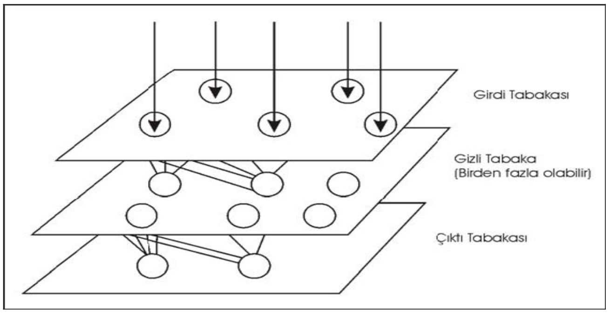

Şekil 2. YSA’ların genel yapısı

Tek tabaka ya da tek eleman içeren bazı başarılı
ağlar oluşturulabilmesine rağmen çoğu uygulamalar en
az üç tabaka (girdi tabakası, gizli tabaka ve çıktı
tabakası) içeren ağlara ihtiyaç duymaktadır. Girdi
tabakası, dışarıdan girdileri alan nöronları içerir.
Ayrıca, önemli olan bir nokta, girdi tabakasındaki
nöronların girdi değerler üzerinde bir işlem
uygulamamasıdır. Sadece girdi değerlerini bir sonraki
tabakaya iletir ve bu yüzden de bazı araştırmacılar
tarafından girdi tabakası ağların tabaka sayısına dahil
edilmezler. Çıktı tabakası ise çıktıları dışarıya ileten
nöronları içeren tabakadır. Girdi ve çıktı tabakaları
birer tabakadan oluşurken bu iki tabaka arasında
birden fazla gizli tabaka bulunabilir. Bu gizli tabakalar
çok sayıda nöron içerir ve bu nöronlar tamamen ağ
içindeki diğer nöronlarla bağlantılıdır. Çoğu ağ türünde,
gizli tabakadaki bir nöron sadece bir önceki tabakanın
tüm nöronlarından sinyal alır. Nöron işlemini yaptıktan
sonra ise çıktısını bir sonraki tabakanın tüm
nöronlarına gönderir. Bu yapı ağın çıktısı için bir ileri
besleme patikası oluşturur. Bir nörondan diğerine olan
iletişim hattı, sinir ağları için önemli bir parçadır. Bazı
ağlarda, bir nöron aynı tabakadaki başka nöronlara
engel oluşturabilir. Bu, yanal engelleme veya rekabet
olarak adlandırılır ve en çok çıktı tabakasında kullanılır.
Diğer bir bağlantı şekli ise geri yayınımdır. Geri
yayınım, bir tabakanın çıktısının önceki tabakaya
gönderilmesi olup Şekil 3’te yanal engelleme ve
rekabet kavramlarıyla birlikte örneklenmiştir.

Yöntem

İleri beslemeli geri yayınım mimarisi 1970’li
yıllarda geliştirilmiştir. Bu mimarinin geliştirilmesinde
birbirlerinden bağımsız olarak birkaç araştırmacının katkıları olmuştur. Asıl katkı ise Rumelhart, Hinton ve
Williams (1986) tarafından yapılmıştır. Ortaya
çıkışından sonra, hem etkili hem de çok kullanışlı
olmasından dolayı büyük bir popülarite kazanmış ve
hala en çok kullanılan ağ türü olarak bilinmektedir
(Yurtoğlu 2005). Çok sayıda farklı uygulama alanında
kullanılmakta olup en büyük özelliği doğrusal olmayan
yapı içeren problemlerde de etkili olabilmesidir. Tipik
bir geri yayınım ağ mimarisinde de bir girdi tabakası,
bir çıktı tabakası ve bu iki tabaka arasında en az bir
adet gizli tabaka bulunur. Gizli tabaka sayısı için
herhangi bir kısıt olmamakla birlikte genellikle bir ya
da iki gizli tabaka kullanılmaktadır. Çalışmada
kullanılan; bir girdi tabakası, bir gizli tabaka ve bir çıktı
tabakası içeren bir geri yayınım ağının genel yapısı
Şekil 4’de örneklenmiştir.

Şekil 4’te, tabakalar halinde düzenlenmiş
daireler işlem elemanlarını yani nöronları temsil
etmektedir. Girdi tabakasında üç adet nöron
bulunmaktadır. Yani ağa girdi olarak üç değişken
tanıtılmaktadır. Bunun dışında gizli tabakada iki, çıktı
tabakasında ise üç adet nöron bulunmaktadır.
Dolayısıyla, ağdan üç değişken olarak çıktı
alınmaktadır. Girdi tabakasından, gizli tabakaya
iletilen değerler “Ağırlıklar 1” ağırlık seti ile, gizli
tabakadan çıktı tabakasına iletilen değerler ise
“Ağırlıklar 2” ağırlık seti ile ağırlıklandırılmaktadır. Geri
yayınım ise sadece eğitme sürecinde kullanılır.
Dolayısıyla eğitme sürecindeki bilgi akışı Şekil 4’teki
tüm oklar ile gösterilmektedir.

Savalan barajı haznesini simüle etmek için
kullanılan 34 yıl süreli aylık ortalama akım verilerinin
ağı yönlendirmesinde yardımcı olmak üzere Neuro