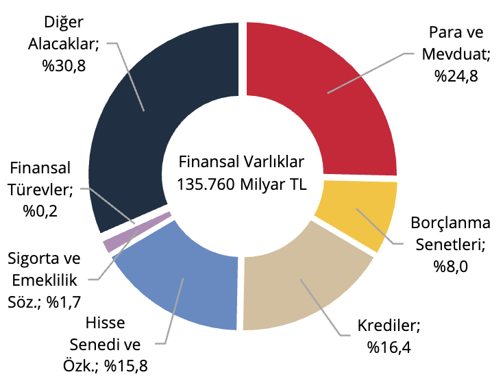
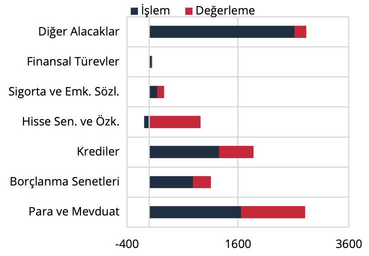
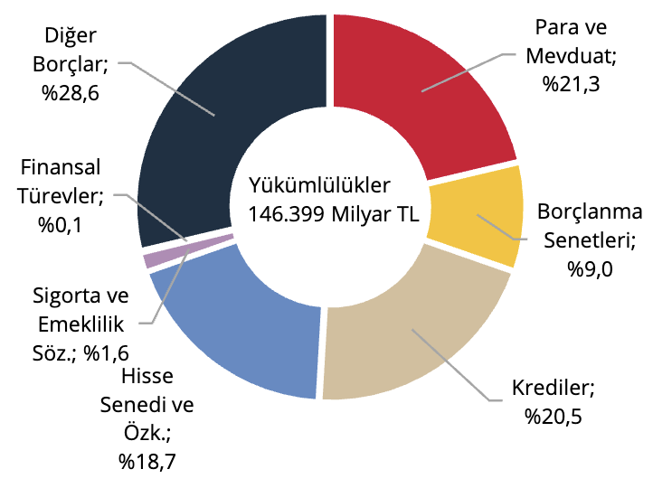
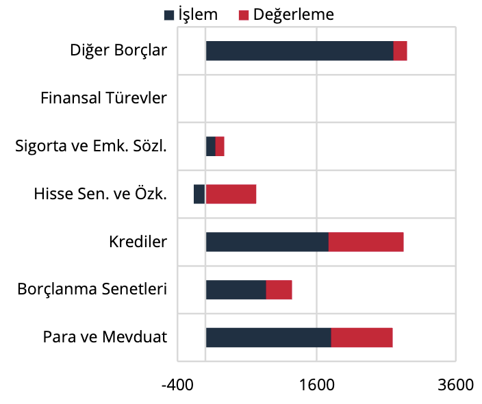

II. Toplam Ekonomi

Toplam ekonominin finansal varlıkları; 2025 yılı birinci çeyreklik döneminde bir önceki döneme göre 10.431
milyar TL artış göstererek 135.760 milyar TL düzeyine yükselmiştir (Grafik 2). İki çeyrek arasındaki artışın 6.415
milyar TL’si işlem kaynaklı, 4.016 milyar TL’si ise varlıklardaki değerlemeden kaynaklıdır. Para ve mevduatlarda
kur kaynaklı 1.160 milyar TL, hisse senetleri ve özkaynaklarda kur ve fiyat kaynaklı 925 milyar ile borçlanma
senetlerinde kur ve fiyat kaynaklı 325 milyar TL pozitif yönlü değerleme gerçekleşmiştir (Grafik 3).

Grafik 2: Finansal Varlıkların Araç Dağılımı,
Stok (%)

Kaynak: TCMB

Grafik 3: Finansal Varlıklar, Akım (Milyar TL)

Kaynak: TCMB

Toplam ekonominin finansal yükümlülükleri; 2025 yılı birinci çeyreklik döneminde bir önceki döneme göre
10.549 milyar TL artış göstererek 146.399 milyar TL düzeyine yükselmiştir (Grafik 4). İki çeyrek arasındaki
artışın 7.121 milyar TL’si işlem kaynaklı, 3.428 milyar TL’si ise yükümlülüklerdeki değerlemeden kaynaklıdır.
Değerleme; mevduatlarda kur kaynaklı 885 milyar TL, hisse senetleri ve özkaynaklarda fiyat kaynaklı 731
milyar TL, borçlanma senetlerinde fiyat ve kur kaynaklı 375 milyar TL, kredilerde ise 1.080 milyar TL olarak
gerçekleşmiştir (Grafik 5).

Grafik 4: Yükümlülüklerin Araç Dağılımı, Stok
(%)

Kaynak: TCMB

Grafik 5: Yükümlülükler, Akım (Milyar TL)

Kaynak: TCMB