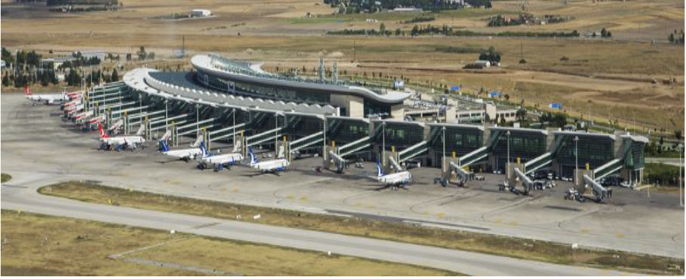
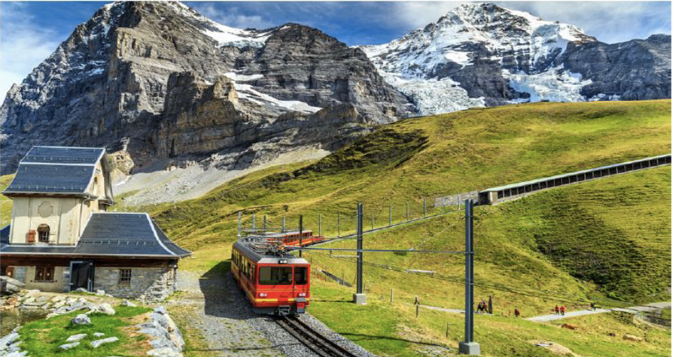

DOĞAL FAKTÖRLER

12\. Sınıf Coğrafya

Yeryüzü Şekilleri

- Hava ulaşımında
özellikle yer seçiminde
yeryüzü şekilleri
dikkate alınmaktadır.

- Demir yollarında
sarp ve eğimli
arazilerde ulaşım
zorlukları vardır.