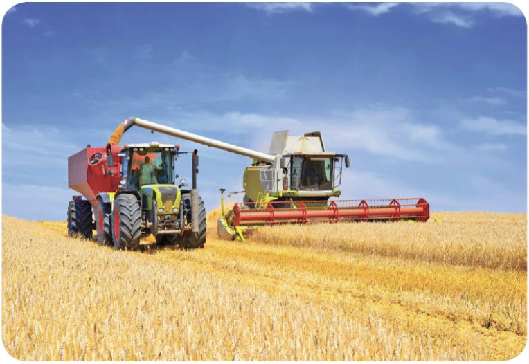

BEŞERİ FAKTÖRLER

12\. Sınıf Coğrafya

Ekonomik Faaliyetler

Ekonomik
faaliyetler ile
ulaşımın
gelişimi doğru
orantılıdır.

Tarımsal ürünlerin, madenlerin ve diğer hammaddelerin işlenmek için
fabrikalara, işlenmiş maddelerin de tüketileceği yerlere gönderilmesi
ancak geniş ve düzenli ulaşım sistemleriyle mümkün olmaktadır.