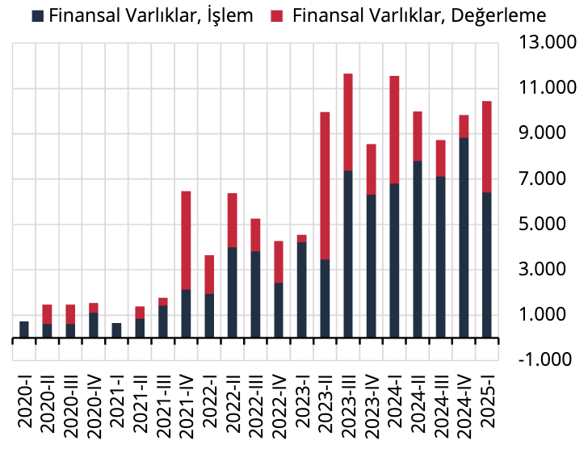
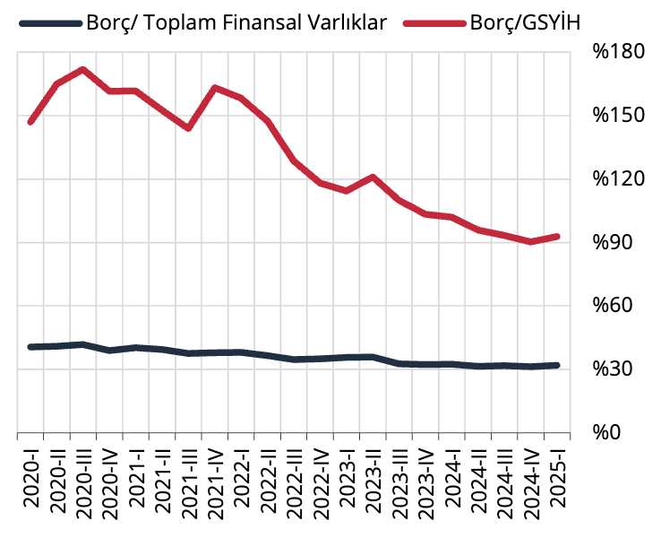

Yılın birinci çeyreğinde varlık ve yükümlülüklerdeki değişim büyük ölçüde işlem kaynaklı gerçekleşirken;
değerleme etkisinin bir önceki çeyreğe göre artış gösterdiği gözlenmektedir (Grafik 6-7).

Grafik 6: Toplam Ekonomi Finansal Varlıklar
Dönemsel Değişim (Milyar TL)

Kaynak: TCMB

Grafik 7: Toplam Ekonomi Yükümlülükler
Dönemsel Değişim (Milyar TL)

Kaynak: TCMB

Toplam ekonominin net finansal pozisyonu 2025 yılı birinci çeyreğinde bir önceki döneme göre 117 milyar TL
azalmıştır. Net finansal pozisyondaki değişimde, krediler ve borçlanma senetleri ile diğer alacaklar
kalemlerindeki net değişim yükümlülük yönlü; para ve mevduat ile hisse senedi özkaynaklar kalemlerindeki
net değişim ise varlık yönlü etkili olmuştur (Grafik 8). Sektörün borçlarının GSYİH’ye oranı %93, toplam finansal
varlıklara oranı ise %32 seviyesinde gerçekleşmiştir (Grafik 9).

Grafik 8: Toplam Ekonomi Net Finansal
Pozisyon Değişimi (Milyar TL)

Kaynak: TCMB, TÜİK.

Grafik 9: Toplam Ekonomi Borcu* (%)

Kaynak: TCMB

(*): Borçlar; krediler ve borçlanma senetlerinden
oluşmaktadır.