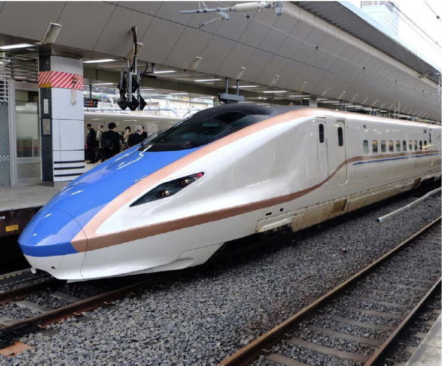

BEŞERİ FAKTÖRLER

12\. Sınıf Coğrafya

Teknolojik Gelişmeler

Teknolojide meydana
gelen gelişmeler
ulaşım sistemlerini
iyileştirmiş, bu durum
yolcu taşımacılığında
güvenlik, konfor
ve hız gibi özellikleri
beraberinde getirmiştir.

