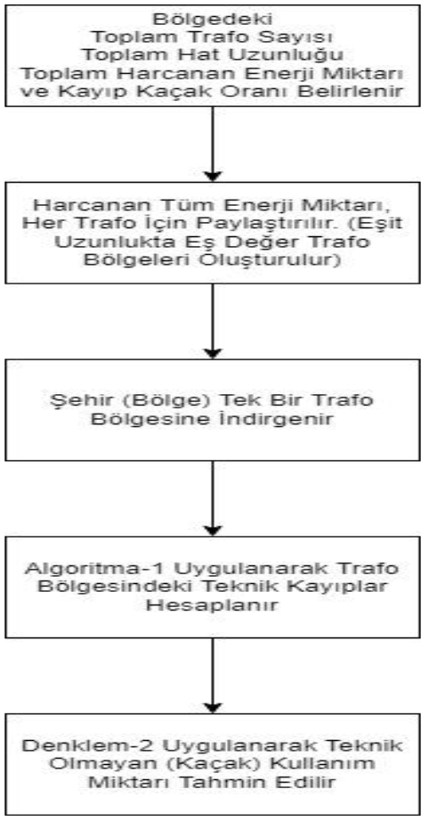
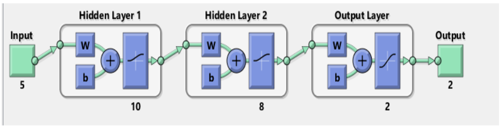

Şekil 2. Bir bölgenin tek trafo bölgesine indirgemesi ve kayıpların tahmin edilmesi

Önerilen algoritma-2 yardımıyla karmaşık bölgeler tek tip trafo bölgesine indirgenebilir ve bölgenin yaklaşık
teknik kayıpları hesaplanabilir. Güç sistemlerinde teknik kayıplar, hat uzunlukları, trafo yapısı ve bilgileri, gerilim
ve güç değerleri bilinen şebekeler için tahmin edilebilir [16,17]. Bir dağıtım şebekesinde harcanan toplam enerji
miktarı, tüm trafo bölgelerine eşit miktarda paylaştırılarak, eş değer trafo bölgeleri elde edilir. Paylaştırılan güç
miktarlarına uygun bir iletken tayin edilerek yeni bir trafo bölgesi oluşturulur. Herhangi karmaşık bir şebekeyi
veya bir şehri tek trafo bölgesine indirgeyerek, teknik kayıpların analizleri bu sayede daha kolay bir şekilde
gerçekleştirilir. Trafo kayıplarını hesaplarken, şebekenin veya bir şehrin genel durumunu veya bölgede kullanılan
trafo tiplerinin yaygınlık durumunun göz önüne alınması, yapılacak tahminin doğruluk oranını artıracaktır. Trafo
bölgesinin çok çeşitli olduğu bölgelerde yaygın kullanılan her çeşit trafo için, yeni trafo bölgeleri oluşturulabilir.
Ancak harcanan enerji miktarları, hat uzunlukları, tayin edilen iletken özellikleri eşit (her bölge için eşdeğer)
olacağından dolayı değişiklik gösterecek tek durum trafolar üzerinde meydana gelen kayıplar olacaktır (E1 değeri
sabit, E2 değeri değişken olacaktır).

Algoritmalar ile elde edilen sonuçlar yapay sinir ağları (YSA) ile de desteklenmiştir [18-25]. Kullanılan YSA
modelinde 5 adet giriş ve 2 adet çıkış bulunmaktadır. Girişler sırasıyla; şehrin toplam trafo gücü, toplam trafo
sayısı, toplam hat uzunluğu, kayıp-kaçak oranı, faturalandırılan ve faturalandırılamayan enerjinin (tüm enerjinin)
toplam miktarı şeklindedir. Çıkışlar ise toplam teknik kayıplar ve tahmin edilen kaçak kullanım miktarıdır.
Oluşturulan YSA ağ yapısı şekil 3’te gösterildiği gibidir.

Şekil 3. Kullanılan YSA ağ yapısı

İleri beslemeli geri yayılımlı (Feed-Foward Backprop) ağ tipi kullanılmıştır. En yüksek doğruluk oranı, nöron
sayıları sırasıyla 10 ve 8 olan iki gizli katmanın kullanılmasıyla elde edilmiştir. Nöron sayılarının belirlenmesinde,
kabul görmüş herhangi bir yöntem olmadığı için nöron sayıları deneme yanılma yoluyla belirlenmiştir. Aktivasyon
fonksiyonu olarak en yaygın kullanılan aktivasyon fonksiyonu sigmoid fonksiyon seçilmiştir. Birden fazla eğitim
fonksiyonları kullanılmış ve eğitim fonksiyonlarının performansları birbirleri ile karşılaştırılmıştır.

2.2. Kullanılan eğitim fonksiyonları

Önerilen algoritmalar birden fazla eğitim fonksiyonu ile eğitilmiş; eğitim ve test sonuçları birbirleri ile
kıyaslanmıştır.