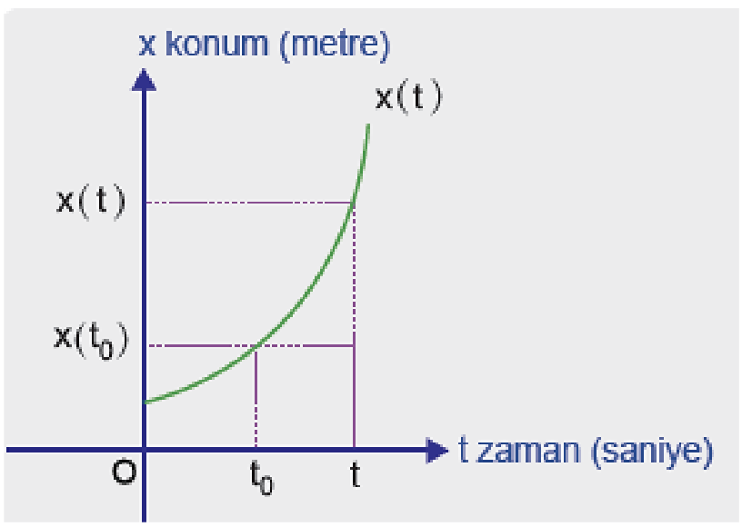

TÜREV

12\. Sınıf Matematik

DEĞİŞİM ORANI:

Yanda doğrusal olarak hareket eden bir
hareketliye ait konum-zaman grafiği verilmiştir. Bu
hareketlinin t0. ve t. saniyeler arasında ortalama
hızı; bu hareketlinin konumundaki değişiminin,
zamandaki değişime oranı ile hesaplanır.

* $v_{ort}$, bu hareketlinin $t_0$. ve $t_1$. saniyeler arasında ortalama hızı
* $\Delta_x$, konumdaki değişimi
* $\Delta_t$, zamandaki değişimi olmak üzere;

$$
    v_{ort} = \frac{\Delta_x}{\Delta_t} = \frac{x(t) - x(t_0)}{t - t_0}
$$

olur.

Burada $\Delta_x$, x bağımlı (t ye bağlı) değişkenin değişimidir.

$\Delta_t$, bağımsız değişkenin değişimidir.

Buna göre $v_{ort} = \frac{\Delta_x}{\Delta_t}$ ifadesine değişim oranı denir.

