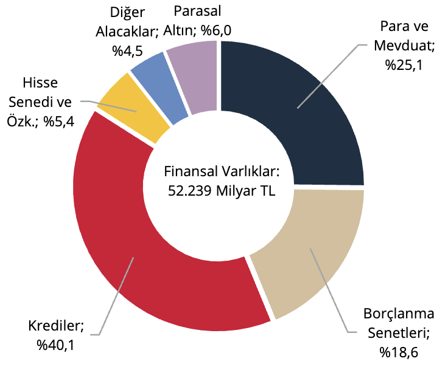
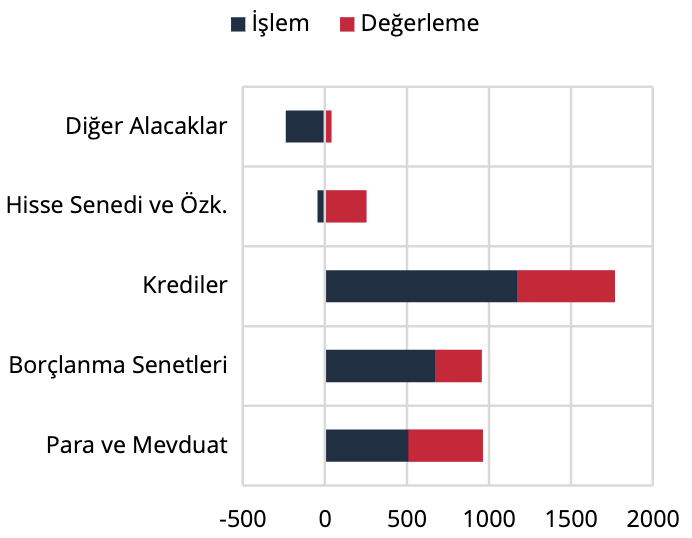
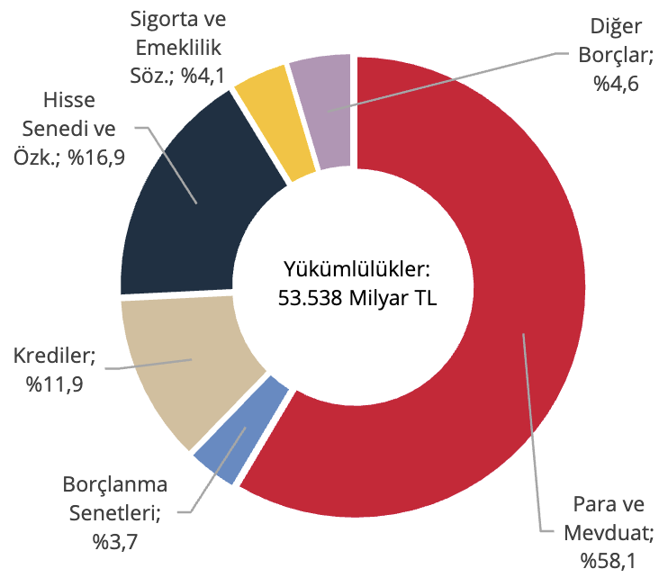
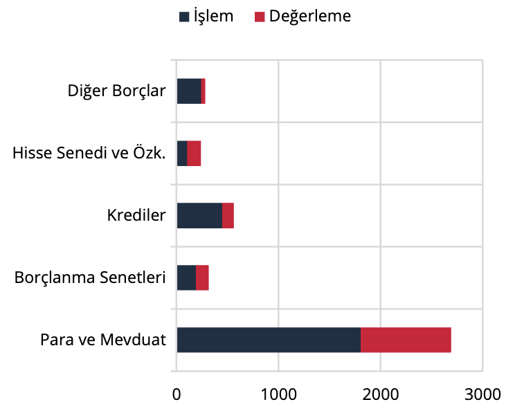

III. Finansal Kuruluşlar

Finansal kuruluşların finansal varlıkları 2025 yılı birinci çeyreklik döneminde bir önceki döneme göre 4.329
milyar TL artış göstermiş ve 52.239 milyar TL olmuştur (Grafik 10). Söz konusu artış 2.056 milyar TL işlem ile
2.273 milyar TL değerlemeden kaynaklanmıştır (Grafik 11).

Grafik 10: Finansal Varlıkların Araç Dağılımı,
Stok (%)

Kaynak: TCMB

Grafik 11: Finansal Varlıklar, Akım (Milyar TL)

Kaynak: TCMB

Finansal kuruluşların yükümlülükleri ise aynı dönemde 4.389 milyar TL artış göstermiş olup, 53.538 milyar TL
düzeyine yükselmiştir (Grafik 12). Bu artışın 2.932 milyar TL’si işlem, 1.457 milyar TL’si ise değerleme
kaynaklıdır (Grafik 13).

Grafik 12: Yükümlülüklerin Araç Dağılımı,
Stok (%)

Kaynak: TCMB

Grafik 13: Yükümlülükler, Akım (Milyar TL)

Kaynak: TCMB