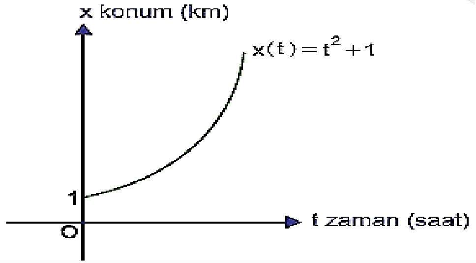

TÜREV

12\. Sınıf Matematik

Örnek:

Aşağıda doğrusal olarak hareket eden bir
hareketliye ait konum-zaman grafiği
verilmiştir. Bu hareketlinin zamana bağlı
konumu $x(t) = t^2 + 1$ fonksiyonu ile
verildiğine göre

a) Bu hareketlinin ilk 4 saatteki ortalama
hızını bulunuz.

b) Bu hareketlinin 1. ve 4. saatler
arasındaki ortalama hızını bulunuz.

