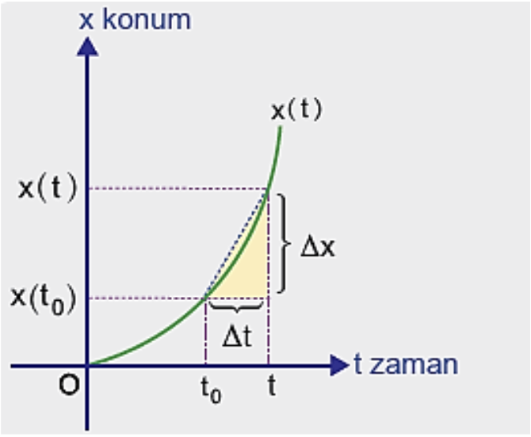

TÜREV

12\. Sınıf Matematik

Anlık Değişim Oranı ve Türev

Yanda doğrusal olarak hareket eden bir
hareketliye ait konum-zaman grafiği
gösterilmiştir. Bu hareketlinin $t$. ve $t_0$. saniyeleri
arasındaki ortalama hızı $v_{ort} = \frac{\Delta_x}{\Delta_t} = \frac{x(t) - x(t_0)}{t - t_0}$
dır.

Bu hareketlinin $t_0$ anındaki anlık hızı bulunmak
istenirse $t$ nin $t_0$ a yaklaşırken fonksiyonun değişim
oranı hesaplanır. Bu oran
$\displaystyle\lim_{t \to t_0}{\frac{x(t) - x(t_0)}{t - t_0}}$
limiti ile
hesaplanır. Bir fonksiyonun $t_0$ anındaki anlık
değişim oranına ise fonksiyonun $t_0$ noktasındaki
türevi denir ve $x'(t_0)$ ile gösterilir. Bir fonksiyonun
bir noktadaki türevi aynı noktadaki teğetinin eğimine
eşittir.
$x'(t_0) = \displaystyle\lim_{t \to t_0}{\frac{x(t) - x(t_0)}{t - t_0}}$
olur.

