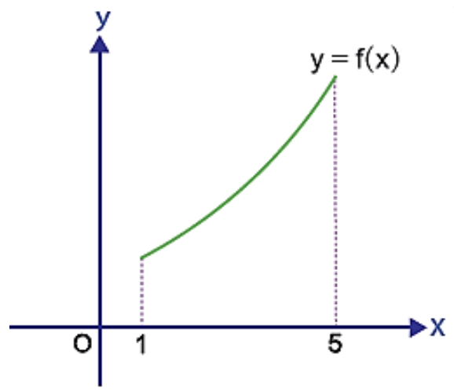
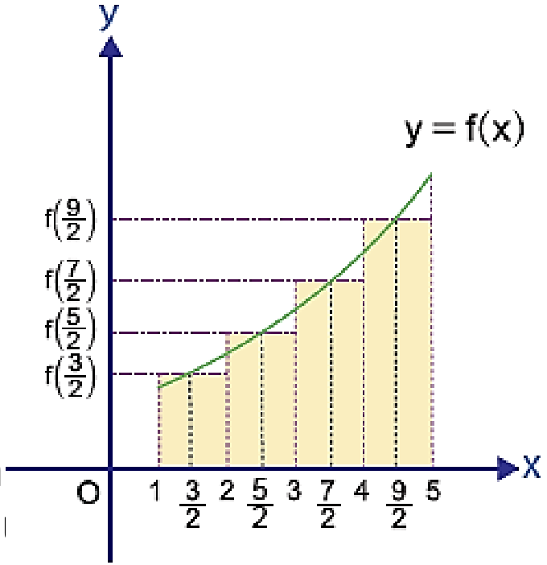

RİEMANN TOPLAMI

12\. Sınıf Matematik

Örnek:

Yukarıda $[1, 5]$ ndan tan $f(x) = x^2 + 2$ fonksiyonun grafiği verilmiştir. $[1, 5]$ nı 4 eşit aralığa bölerek her alt aralığın orta noktasına göre hesaplanan Riemann toplamını bulunuz.