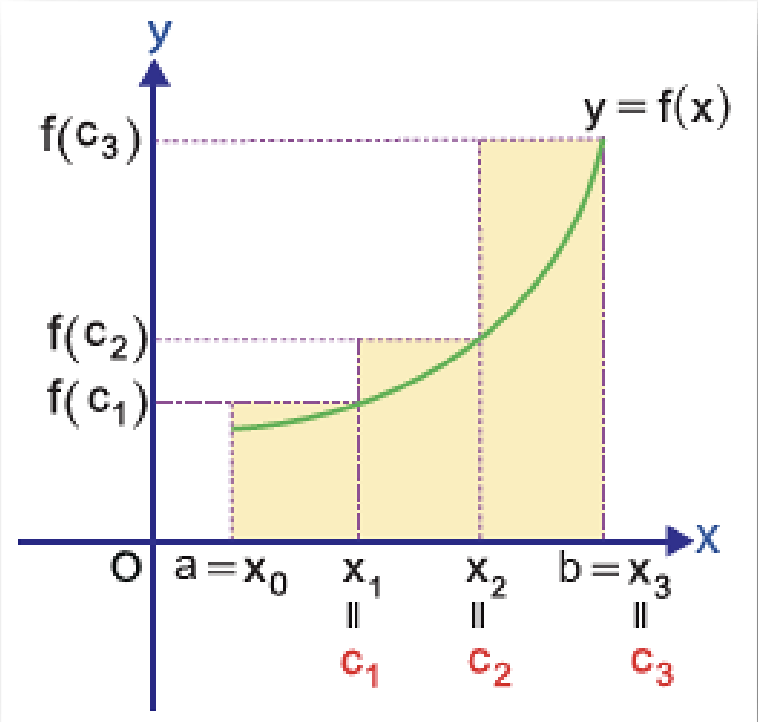

RİEMANN ÜST TOPLAMI

12\. Sınıf Matematik

* $c_1 \in [x_0, x_1]$ için $f(c_1)$, $[x_0, x_1]$ nın görüntü kümesinin en büyük elemanı,
* $c_2 \in [x_1, x_2]$ için $f(c_2)$, $[x_1, x_2]$ nın görüntü kümesinin en büyük elemanı,
* $c_3 \in [x_2, x_3]$ için $f(c_3)$, $[x_2, x_3]$ nın görüntü kümesinin en büyük elemanı olmak üzere

Grafikte oluşan boyalı dikdörtgenlerin toplam alanını veren
$\Delta x_1 . f(c_1) + \Delta x_2 . f(c_2) + \Delta x_3 . f(c_3)$
toplamına $f(x)$ fonksiyonunun $[a, b]$
na ait bir Riemann üst toplamı denir. Burada $[a,b]$ 3 alt aralığa ayrılmıştır.
Eğer $[a,b]$ daha fazla alt aralığa ayrılırsa bulunan Riemann üst toplamının
değeri, eğrinin altında kalan alanın değerine daha yakın olur.