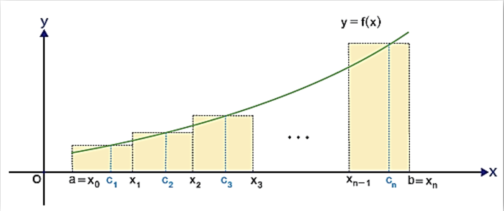

RİEMANN TOPLAMI

12\. Sınıf Matematik

SONUÇ:

$f$ fonksiyonunun $[a,b]$ nda hesaplanan Riemann toplamı $A$ ise $y=f(x)$ eğrisinin altında kalan alan yaklaşık olarak $A=\Delta x.f(c_1) + \Delta x.f(c_2) + \Delta x.f(c_3) + ... + \Delta x.f(c_n) = \sum_{k=1}^{n}{\Delta x.f(c_k)}$
Buna göre Riemann toplamı n nin sonsuza yaklaşması
durumunda $y=f(x)$ ile $x$ ekseni arasında kalan alanı
vereceğinden $\displaystyle\lim_{n \to \infty}{\Delta x.f(c_k)}$ limiti ile hesaplanır.
Ayrıca $\displaystyle\lim_{n \to \infty}{\Delta x.f(c_k)}$ değerine $f$ fonksiyonunun $[a,b]$ ndaki belirli integrali denir.
$\displaystyle\lim_{n \to \infty}{\Delta x.f(c_k) = \int_{a}^{b}{f(x)dx}}$