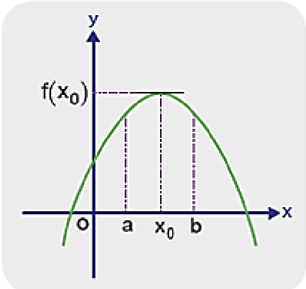
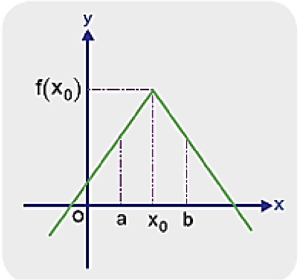
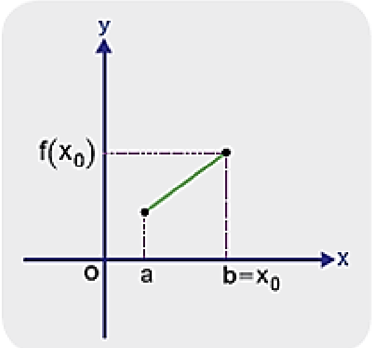

TÜREV UYGULAMALARI

12\. Sınıf Matematik

Bir Fonksiyonun Yerel Maksimum ve Mutlak Maksimum
Noktaları

$f: A \to \mathbb{R}$ ve $(a,b) \subseteq A$ olmak üzere bir $x_0 \in (a,b)$ için fonksiyonun bu aralıktaki en büyük değeri $f(x_0)$ oluyorsa $(x_0, f(x_0))$ noktasına f fonksiyonunun bir yerel maksimum noktası denir.

