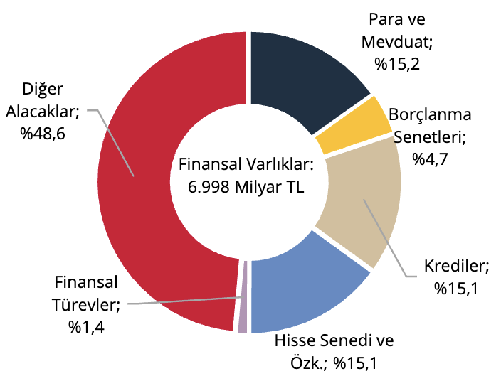
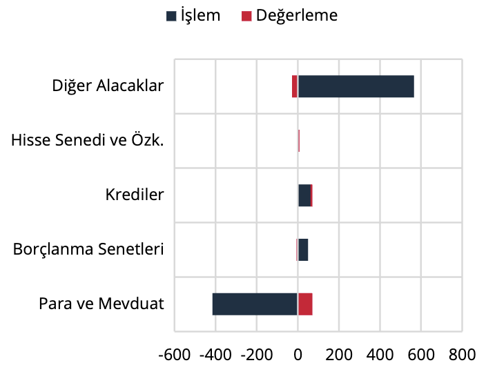
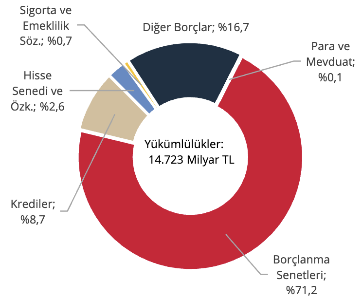
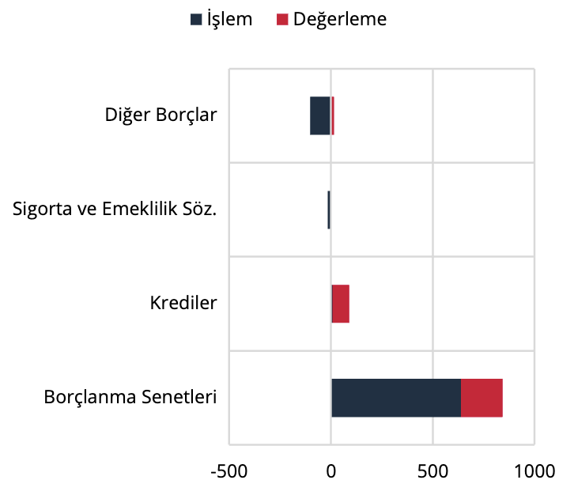

IV. Genel Yönetim

Genel yönetimin finansal varlıkları 2025 yılı birinci çeyreklik döneminde bir önceki döneme göre 387 milyar
TL artış göstererek 6.998 milyar TL düzeyinde gerçekleşmiştir (Grafik 14). Söz konusu artışın 331 milyar TL’si
işlemden, 55 milyar TL’si ise değerlemeden kaynaklanmıştır (Grafik 15).

Grafik 14: Finansal Varlıkların Araç Dağılımı,
Stok (%)

Kaynak: TCMB

Grafik 15: Finansal Varlıklar, Akım (Milyar TL)

Kaynak: TCMB

Genel yönetimin yükümlülükleri ise aynı dönemde 841 milyar TL artış göstermiş olup, 14.723 milyar TL
düzeyine yükselmiştir (Grafik 16). Bu artışın 531 milyar TL’si işlem, 310 milyar TL’si değerleme kaynaklıdır
(Grafik 17).

Grafik 16: Yükümlülüklerin Araç Dağılımı,
Stok (%)

Kaynak: TCMB

Grafik 17: Yükümlülükler, Akım (Milyar TL)

Kaynak: TCMB