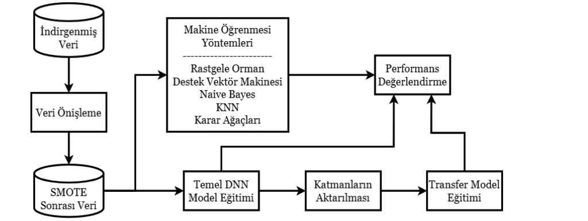

gerçekleştiğini ve literatürde belirsiz veya eksik türlere sahip 6051 HIPPARCOS değişkeni için tür tahmininde uygulandığını belirtmişlerdir.

Hon vd. (2017) katlanmış titreşim spektrumlarının görüntülerinden bu görsel özellikleri otomatik olarak öğrenmek için denetimli öğrenme ile 1D evrişimli sinir ağı eğitmişlerdir. Kepler kırmızı devlerinde eğitim ve test yaparak, helyum yanma işlemi gören kırmızı devleri, kırmızı dev koldan yükselenlerden %99'a varan bir doğrulukla ayırmayı başarmışlardır.

2. YÖNTEM

Bu çalışmada astronomi araştırmaları neticesinde açılan verilerden yapılmış çalışmalardan elde edilen veri setleri kullanılmıştır. Şekil 2’de görüldüğü gibi veri seti makine öğrenmesine uygun bir hale getirilmesi için ön işlemlerden geçirilmiş ve DNN (Derin sinir ağları) dahil olmak üzere çeşitli makine öğrenmesi yöntemleri ile modeller eğitilerek performansları değerlendirilmiştir.

Şekil 1. Çalışmanın akış diyagramı

2.1. Veri Seti

CoRoT (Convection, Rotation and planetary Transits), Avrupa Uzay Ajansı (ESA) tarafından geliştirilen bir uzay teleskopu projesidir. CoRoT, yıldızların iç yapılarını, dönüş hızlarını ve gezegen geçişlerini incelemek amacıyla 2006 yılında fırlatılmıştır. CoRoT, uzaydan yıldızları sürekli olarak gözlemleyerek, yıldızların ışık eğrisindeki değişimleri ve gezegenlerin yıldız önünden geçişlerini tespit eder. Bu bilgiler, yıldızların iç yapısını, dönme hızlarını, yerleşik manyetik alanlarını ve gezegenlerin boyutlarını ve yörüngelerini belirlemek için kullanılır.

Bu çalışmada test edilen makine öğrenmesi yöntemleri ve yapay sinir ağları eğitiminde, Corot hedefleri için elde edilen ışık eğrilerinden çıkarılan verilerle oluşturulmuş, Sarro vd. (2013) çalışmalarından elde edilen veri seti kullanılmıştır. Yine transfer öğrenimi testi için Dubath vd. (2011) HIPPARCOS veri seti için yaptıkları çalışma ile üretilen veri seti kullanılmıştır. Bu çalışmada kullanılan veri setleri CDS tarafından sunulan lisans altında kullanılmıştır. Bu lisans, veri setinin ticari olmayan kullanımına kaynak ve lisans bilgilerinin uygun şekilde belirtilmesi şartı ile izin vermektedir.

Veri seti VLT’deki Giraffe spektrografi ile gözlemlenen CoRoT hedeflerini sınıflandırmada kullanılan hem fotometrik zaman serisinden türetilen hem de spektrumlardan türetilen fiziksel parametreleri içerir. Veri setinde yaklaşık 10100 kayıt bulunmaktadır. Ön deneylerde veri setindeki bazı sınıflara ait örnek sayıları çok düşük olduğu için, modeli aşırı uyum problemine götürdüğü görülmüştür. Bu sebeple bu sınıflar veri setinden atılmıştır.

2.2. Veri Önişleme

Veri önişleme süreci, sınıflandırma algoritmalarından daha doğru sonuçlar alınması ve daha iyi performans göstermesi amacıyla veri setindeki uygunsuzlukları gidermek için gerekli bir çalışmadır.

