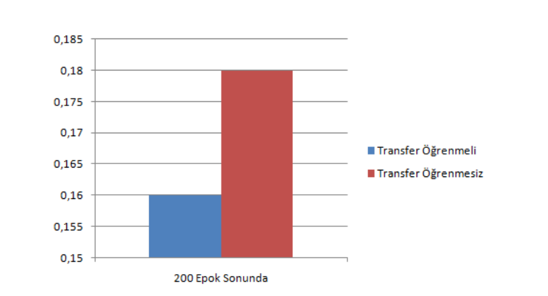
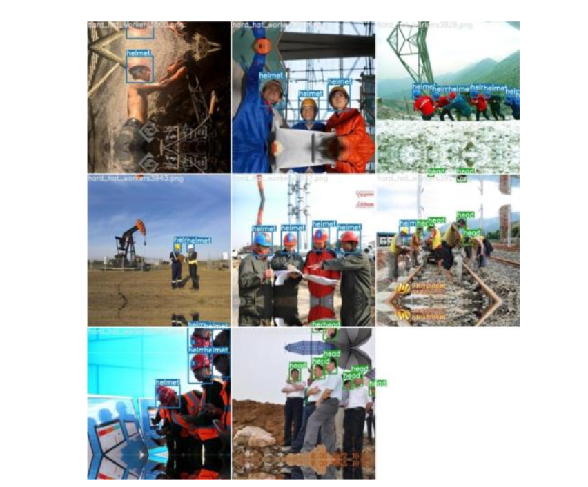

Şekil 3. Faster R-CNN transfer öğrenmenin uygulanmadığı/transfer öğrenmeli 200 epokluk eğitim sonucundaki yitim değeri

Şekil 4. YOLO V4 transfer öğrenmenin uygulanmadığı/transfer öğrenmeli 200 epokluk eğitim sonucundaki yitim değeri

Şekil 5. YOLO V5 transfer öğrenmenin uygulanmadığı/transfer öğrenmeli 200 epokluk eğitim sonucundaki yitim değeri

Kayıp değeri, bizim problemimiz için kask tespit hatasını göstermektedir. Yani ne kadar büyük bir yitim değeri çıkarsa o kadar yanlış tespit yapılmış demektir. 200 epok sonucunda, 6 model arasında 0.1 ile en düşük (başarılı) yitim değerine ulaşan model, transfer öğrenmeli YOLO V5’tir. Transfer öğrenmeli YOLO V5 modeli %98 f1 skor ile en yüksek başarıma ulaşmıştır.

Şekil 6. Transfer öğrenmeli YOLO V5 modelinden birkaç başarılı örnek

Tablo 1’den görüleceği üzere transfer öğrenmenin uygulandığı modeller, 3.500 adet eğitim ve validasyon görüntüsü üzerindeki 200 epokluk eğitimlerinde süre açısından bir avantaj sağlamamış aynı zamanda kayda değer bir zaman kaybına sebep de açmamıştır. Tüm modellerin en baştan eğitimleri, transfer öğrenmenin uygulandığı modellere göre az da olsa daha kısa sürede tamamlanmıştır.

Transfer öğrenmenin uygulanmadığı modellerin doğru tespit oranları transfer öğrenme uygulananlara göre daha az çıkmıştır. Transfer öğrenme modellerinin yüksek başarım çıkmasındaki sebep yanlış tespit oranlarının daha az olmasıdır.

6 modelin 750 test görüntüsündeki 3.564 adet nesneyi tespit başarım karşılaştırmasını sunan karışıklık matrisleri Şekil 7’de gösterildiği gibidir.

Tablo 1. Modellerin eğitim süresi karşılaştırması**

<table>
  <tr>
    <td><strong>Eğitim modelleri (200 Epok)</strong></td>
    <td><strong>Eğitim süreleri (saat)</strong></td>
  </tr>
  <tr>
    <td>Transfer öğrenmesiz Faster R-CNN</td>
    <td>64.53</td>
  </tr>
  <tr>
    <td>Transfer öğrenmeli Faster R-CNN</td>
    <td>65.58</td>
  </tr>
  <tr>
    <td>Transfer öğrenmesiz YOLO V4</td>
    <td>15.13</td>
  </tr>
  <tr>
    <td>Transfer öğrenmeli YOLO V4</td>
    <td>15.30</td>
  </tr>
  <tr>
    <td>Transfer öğrenmesiz YOLO V5</td>
    <td>4.65</td>
  </tr>
  <tr>
    <td>Transfer öğrenmeli YOLO V5</td>
    <td>4.84</td>
  </tr>
</table>
