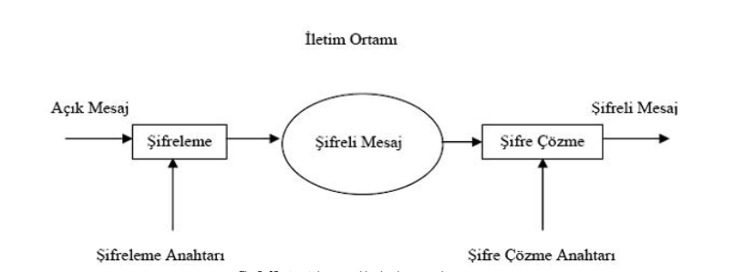

Şekil 1. Simetrik kripto sistem

2. Ön Hazırlık 
 
Tanım 2.1.

Bir $f$ fonksiyonu tüm $t \gt 0$ için tanımlı, $\alpha$ bir sabit ve $M$ pozitif bir tamsayı olmak üzere $f$ fonksiyonu $e^{-\alpha t} |f(t)| \le M$ şeklinde yazılabiliyorsa bu $f$ fonksiyonuna **üstel mertebeli fonksiyon** denir ve buradan

$$|f(t)| \le M e^{\alpha t} \quad (2.1)$$

yazılabilir. $f(t)$ üstel fonksiyon ise $t \to \infty$ için $f(t) = \infty$ olur [1].

Tanım 2.2.

$t \ge 0$ ve $t, s \in \mathbb{R}$ olmak üzere $f(t)$ üstel fonksiyonu için

$$F(s) = \int_{0}^{\infty} e^{-st} f(t) dt \quad (2.2)$$

ise $F$ fonksiyonuna $f$ fonksiyonunun Laplace dönüşümü denir [1]. Tanım 2.1 ve Tanım 2.2'den hareketle $f(t)$ fonksiyonu için Laplace dönüşümünü genişleterek yeni bir dönüşüm fonksiyonunu şu şekilde tanımlayalım;

Tanım 2.3.

Tüm $t \ge 0$ reel sayıları için $f(t)$'nin bir dönüşümü

$$F(h) = T[f(t)] = \int_{0}^{\infty} \frac{1}{h} e^{-\frac{t}{h}} f(t) dt \quad (2.3)$$

şeklinde tanımlanır. (Genişletilmiş Laplace dönüşümü) $f(t) = T^{-1}[F(h)]$ ile de $f(t)$'nin ters dönüşümü gösterilir. Elde edilen Genişletilmiş

Laplace dönüşümü aşağıdaki standart sonuçlara sahiptir; [3, 4]

1. $$T\{t^n\} = \frac{n!}{s^{n+1}} \implies T^{-1}\left\{\frac{1}{s^{n+1}}\right\} = \frac{t^n}{n!}$$

2. $$T\{t^n e^{st}\} = \frac{n!h^n}{(1-sh)^{n+1}} \implies T^{-1}\left\{\frac{h^n}{(1-sh)^{n+1}}\right\} = \frac{t^n e^{st}}{n!} \quad (t \ge 0) \quad (2.4)$$

3. Uygulama

3.1. Şifreleme

"FIRAT" mesajını göndermek istediğimizi farz edelim;

Öncelikle $e^t$ ile genişletilen Taylor serisini göz önüne alalım. Taylor serisi;

$$f(x) = f(a) + \frac{f'(a)}{1!}(x-a) + \frac{f''(a)}{2!}(x-a)^2 + \dots = \sum_{n=0}^{\infty} \frac{f^{n}(a)}{n!}(x-a)^n \quad (3.1)$$

dir. Buradan;

$$e^t = 1 + \frac{t}{1!} + \frac{t^2}{2!} + \frac{t^3}{3!} + \dots = \sum_{n=0}^{\infty} \frac{t^n}{n!} \quad (3.2)$$

serisini $t^3$ ile genişletirsek

$$t^3 e^t = t^3 + \frac{t^4}{1!} + \frac{t^5}{2!} + \frac{t^6}{3!} + \dots = \sum_{n=0}^{\infty} \frac{t^{n+3}}{n!} \quad (3.3)$$

olur. Buradan da;

$$f(t) = \sum_{n=0}^{\infty} K_n \frac{t^{n+3}}{n!} \quad (3.4)$$

elde edilir. Alfabenin harfleri sıfırdan başlanarak numaralandırılırsa "FIRAT" düz metni