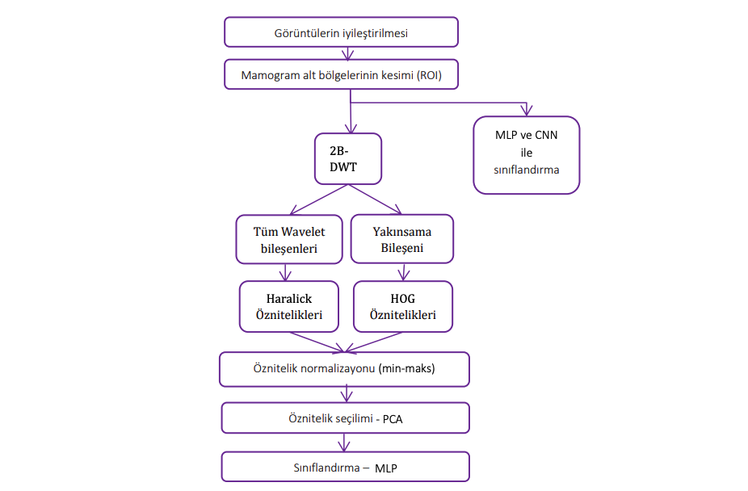
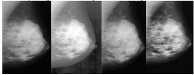

bulunmaktadır.
2.2. ROI Algılanması (ROI Detection)

Önerilen yöntem üç ana görevi içermektedir: görüntü iyileştirilmesi, öznitelik çıkarımı ve sınıflandırma. 
Mamogramların düşük görüntü kalitesini iyileştirmek ve belirsiz tümör bölgelerini daha belirgin yapmak için, orijinal mamogram görüntüleri üzerinde görüntü iyileştirme teknikleri kullanılmıştır. 

Öznitelik çıkarımı, iyileştirilmiş mamogram görüntülerinden elde edilen görüntülere uygulanmıştır. Bir sonraki adımda, bir sınıflandırıcı, seçilen bölgeyi temsil eden özniteliklerin bir ROI’ye veya sağlıklı bir dokuya ait olup olmadığına karar vermiştir. 

Önerilen yöntemin adımlarını özetleyen bir akış diyagramı Şekil 2’de gösterilmiştir.

Şekil 2. Önerilen ROI algılama yönteminin akış diyagramı

Mamogramdaki tümör bölgelerini vurgulamak için bir takım görüntü geliştirme teknikleri denenmiştir. 
Bu teknikler: histogram denkleştirme, genleşme süzgeci (dilation) ve CLAHE işlemleridir (Şekil 3). 
Görüntü iyileştirme işlemlerini uygulamak için Python’un OpenCV kütüphanesi kullanılmıştır (Bradski vd., 2008).

Şekil 3. Orijinal mamogram ve görüntü iyileştime teknikleri uygulanmış mamogramlar (a) orijinal mamogram (b) histogram
denkleştirme uygulanmış mamogram (c) genleşme süzgeci uygulanmış mamogram (d) CLAHE uygulanmış mamogram

2.3.1 Histogram Denkleştirme (Histogram Equalization)
Evrensel karşıtlığı ayarlamak için histogram eşitleme kullanılmıştır. Histogram denkleştirme için, öncelikle
histogramdan yararlanılarak aşağıdaki gibi birikimli histogramlar çıkarılmaktadır: 

$$s_k = T(r_k) = \frac{L - 1}{MN} \sum_{i=0}^{k} n_i \quad (1)$$