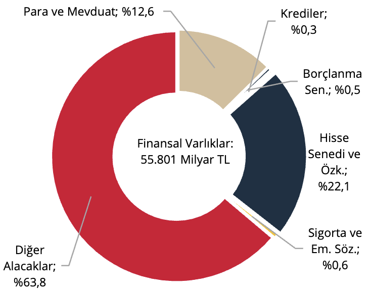
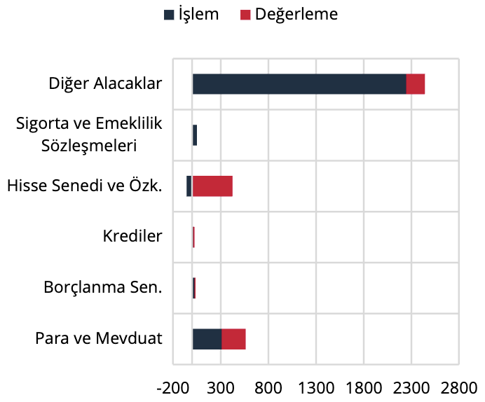
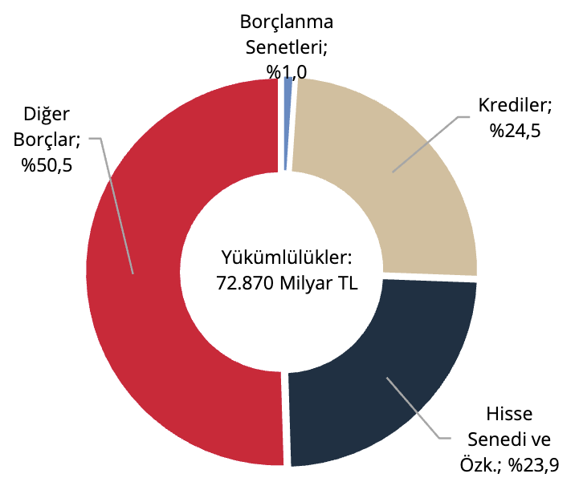
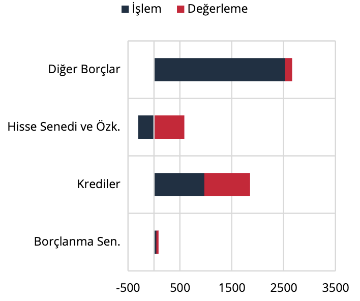

V. Firmalar (Finansal Olmayan Kuruluşlar)

Finansal olmayan kuruluşların finansal varlıkları 2025 yılı birinci çeyreklik döneminde bir önceki döneme göre
3.473 milyar TL artış göstermiş ve 55.801 milyar TL düzeyinde gerçekleşmiştir (Grafik 18). Söz konusu
değişimde işlem kaynaklı 2.571 milyar TL ve değerleme kaynaklı 902 milyar TL artışlar etkili olmuştur (Grafik
19).

Grafik 18: Finansal Varlıkların Araç Dağılımı,
Stok (%)

Kaynak: TCMB

Grafik 19: Finansal Varlıklar, Akım (Milyar TL)

Kaynak: TCMB

Finansal olmayan kuruluşların yükümlülükleri ise aynı dönemde 4.904 milyar TL artış göstermiş olup, 72.870
milyar TL düzeyine yükselmiştir (Grafik 20). Bu değişimde işlem kaynaklı 3.245 milyar TL’lik ve değerleme
kaynaklı 1.659 milyar TL’lik artışlar etkili olmuştur (Grafik 21).

Grafik 20: Yükümlülüklerin Araç Dağılımı,
Stok (%)

Kaynak: TCMB

Grafik 21: Yükümlülükler, Akım (Milyar TL)

Kaynak: TCMB