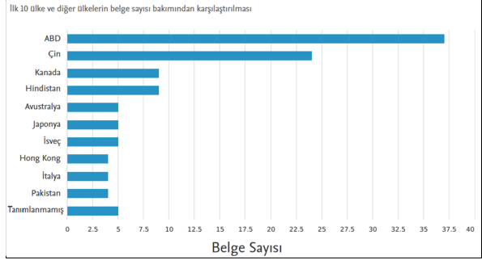

Şekil 3. 1974-2022 Yılları Arasında Doğal Dilden Kod Oluşturma Problemi İiçin Çalışma Yapan Ülkeler (Scopus, 2023).

Şekil 3'te, bu alanda en fazla çalışma yapan ülkelerin çalışma grafiği sunulmaktadır. Şekilden de
anlaşılacağı üzere, dünya genelinde giderek popüler hale gelen bir konu ülkemizde henüz yeterince
ilgiyi görememektedir. Bu durum, ülkemizde yapılacak çalışmaların güncel teknolojilere ayak
uydurma açısından kritik bir öneme sahip olduğunu göstermektedir.

2. DOĞAL DİLDEN PROGRAMLAMA DİLİ KODU OLUŞTURMA PROBLEMİ İÇİN
KULLANILAN YÖNTEMLER
2.1. Temel Terimler
2.1.1. Doğal dil işleme
Doğal dil işleme, bilgisayarların doğal dil ifadelerini anlamak ve üzerinde değişiklikler
gerçekleştirebilmek için bu doğal dil verilerini nasıl kullanılabileceğini araştıran bir uygulama
alanıdır. Bu alandaki araştırmacılar, bilgisayar sistemlerinin belirli görevleri yerine getirebilmesi
için doğal dilleri anlamasını ve manipüle etmesini sağlamak amacıyla insanların dili
anlamlandırma süreçlerini anlamayı hedefler (Chowdhary, 2020).
Doğal dil anlama, insanların kullandığı doğal dil ifadelerini anlama sürecini temsil eder ve bu,
Doğal dil işlemenin önemli bir alt alanını oluşturur. Doğal dil anlama sadece insanların kendi
aralarındaki iletişimi kolaylaştırmakla kalmaz, aynı zamanda insan-makine etkileşimine de katkı
sağlar. Son yıllarda, makine öğrenmesi ve derin öğrenme terimleri sıklıkla doğal dil işleme
kavramlarıyla birlikte anılmaktadır. Doğal dil işleme alanında yapılan çalışmalara bakıldığında,
derin öğrenme mimarileri ile geliştirilen yöntemlerin diğer pek çok yöntemden daha başarılı
sonuçlar elde ettiği görülmektedir.
İncelenen makalelerin temelinde, doğal dilin anlaşılması gibi kritik bir problem yatmaktadır.
Kelimelerin morfolojik yapısı, kullanılan doğal dilin doğası, dilin gramer kuralları, doğal dil 