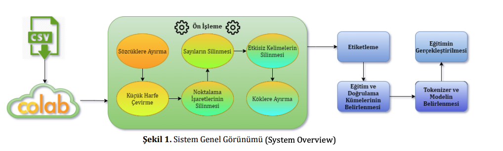

Ortaya koyduğumuz bu çalışma ile metin sınıflandırma yöntemlerinden biri olan “Çok Sınıflı Sınıflandırma”
probleminin Türkçe dili için BERT derin öğrenme tekniği kullanılarak çözülmesi hedeflenmiş ve
gerçekleştirilmiştir. Birçok eğitimden geçmiş farklı veri setleri ve doğrulama kümesi ile kapsamlı bir başarım
tablosu (Tablo 10) elde edilmiştir. Elde edilen bu başarım tablosu ile gelecekteki “Çok Sınıflı Sınıflandırma”
problemlerinin Türkçe dili için BERT derin öğrenme tekniği uygulanarak gerçekleştirilecek çalışmalara ışık
tutulması ve daha yüksek başarım oranlarına ulaşılması temenni edilmektedir.

2. Materyal ve Yöntem (Material and Method)
Günümüzde lisans eğitimini tamamlayan çoğu öğrenci, daha iyi bir gelecek için ikinci bir yeterlilik almaya karar
verir ve lisans üstü eğitimine başlar. Yüksek lisans, lisans öğretimine dayalı eğitim-öğretim ve araştırmanın
sonuçlarını ortaya koymayı amaçlayan bir yükseköğretimdir. Yüksek lisans eğitimi, kişinin eğitim aldığı branşta
uzmanlaşması ve bu durumu bilimsel bir tezle ispat etmesiyle tamamlanır. Her yıl sayısız mezun veren yüksek
lisans programları ile sayısız bilimsel tez akademimize kazandırılmaktadır.
Bir diğer önemli konu ise fikri ve sınai mülkiyet haklarından biri olan patenttir. Bir buluşa sahip olan kişinin,
buluşa konu olan ürünü, belirlenen süre boyunca üretme, kullanma, satma ya da ithal etme hakkına sahip olması
durumuna patent hakkı adı verilir. Bu hakkın somut göstergesi olan belge ise patent adını taşır. Günümüzde bilgiye
dayalı faaliyetlerin artması ile birlikte patentin önemi daha da artmıştır.
Tez ve patentlerin ortak noktaları, ortaya konulan eserin bir kategoriye ait olmasıdır. Hem tez yazarı hem de patent
yazarı, çalışmalarının içerdiği kategoriyi kendileri yazarak belirtmektedir. İnternet üzerinden erişime açık olan bu
iki alanda da kategorisi belirlenmemiş birçok eser mevcuttur. Günümüz teknolojisinde yapay zeka teknolojisi ile
metinlerin kategorilerinin belirlenmesi sağlanabilmektedir. Bu çalışma buradan yola çıkarak özellikle Türkçe
dilinde yazılan bilimsel metinlerin BERT derin öğrenme tekniği uygulanarak çoklu sınıflandırılmasını konu
edinmiştir. İlk aşama olarak bir veri seti oluşturulmuştur. Oluşturulan veri seti üzerinde ön işleme (Preprocessing) gerçekleştirilmiştir. Ön işlemeden geçirilen veri seti için eğitim ve doğrulama setleri belirlenmiştir.
Sonrasında BERT derin öğrenme tekniği uygulanarak bir performans metriği olan F1 skoru elde edilmiştir.
Çalışmaya ait aşamalar ve sistemin genel görünümünü içeren diyagram Şekil 1 üzerinde görülebilir. Devamındaki
bölümlerde ise çalışmanın ayrıntıları detaylı bir şekilde sunulmuştur.

Şekil 1. Sistem Genel Görünümü (System Overview)

2.1. Metin Sınıflandırma (Text Classification)

Metin sınıflandırma sorunu, 𝐵 = {𝑏1, 𝑏2, … , 𝑏𝑛} kümesindeki her bir belgenin (metin), önceden tanımlanmış 𝑆 =
{𝑠1, 𝑠2, … , 𝑠𝑚} kümesindeki sınıflara ait olup olmadığının belirlenmesidir. Yani her (𝑏𝑗, 𝑠𝑖) ∈ 𝐵 𝑥 𝑆 çifti için doğru
ya da yanlış biçiminde bir mantıksal değer üretilmesi gerekmektedir. (Tantuğ, 2016) Metin sınıflandırma,
verilerden kolayca iç görü elde etmeye olanak sağladığı için yapay zeka dünyasının gün geçtikçe daha da önemli
bir parçası haline gelmiştir. Veriler belirli bir şekilde düzenlenmedikçe bu verilerden değer elde etmek zordur.
Metin etiketleme veya metin kategorizasyonu olarak da bilinen metin sınıflandırması, veri olarak ele alınan metni
organize gruplar halinde kategorize etme işlemidir. Bir Doğal Dil İşleme alt konusu olan metin sınıflandırma ile
metin analiz edilir ve ardından içeriğine göre önceden tanımlanmış bir dizi etikete veya kategoriye atanabilir. Bu
atamanın sonucunda metin kategorilere ayrılmış olur ve düzensiz veri düzenlenerek kullanılmak üzere bir değer
elde edilir. Metin sınıflandırması için kullanılan başlıca yöntemler bir sonraki konu başlığında ayrıntılı bir şekilde ele alınmıştır.