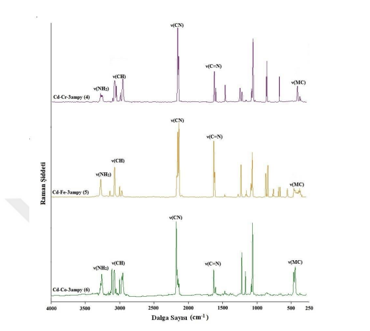

Şekil 6.7. 3ampy ve 4-6 komplekslerinin (a) kızılötesi ve (b) Raman spektrumları.

N-H titreĢimleri
ν(NH) gerilme titreĢimleri kızılötesi spektrumlarda 3400-3100 cm-1
dalga sayısı aralığında meydana gelmektedir (Ahluwalia, 2023). Komplekslerin kızılötesi
spektrumlarından -NH gerilme ve bükülme titreĢimlerine ait bantlar incelendiğinde, 4aepy
ve 3ampy ligantlarının kızılötesi spektrumlarında asimetrik ve simetrik ν(NH) gerilme titreşim dalga sayıları 3350-3199 cm-1
aralığında gözlenmiştir (Niven ve Percy, 1978;
Rastogi ve Sharma, 1974). Çizelge 6.3 ve 6.4’de görüldüğü gibi, 1-6 komplekslerinin
kızılötesi spektrumlarında asimetrik ve simetrik ν(NH) gerilme titreşim dalga sayıları
sırasıyla {[Cu(H2O)(μ-4aepy)Cu(μ-4aepy)2Cu(μ-4aepy)Co2(μ-CN)6(CN)6]·3H2O}n (1)
kompleksi için 3383 ve 3285 cm-1
,(NH4)[Cd(μ-4aepy)2Co(μ-CN)2(CN)4]n (2) kompleksi
için 3362 ve 3283 cm-1
,(NH4)[Cd(μ-4aepy)2Fe(μ-CN)2(CN)4]n (3) kompleksi için 3369 ve