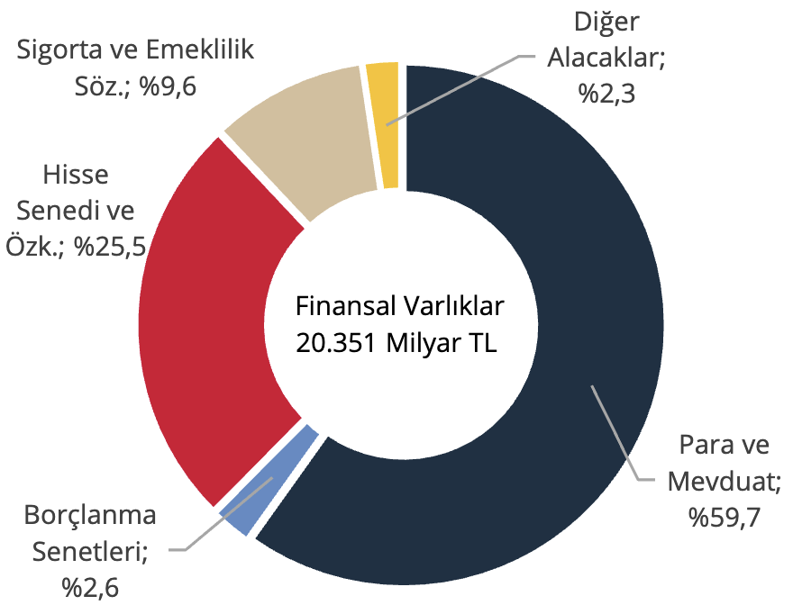
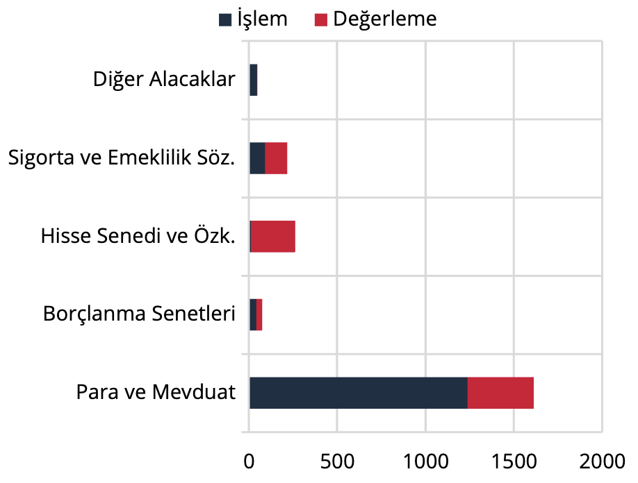
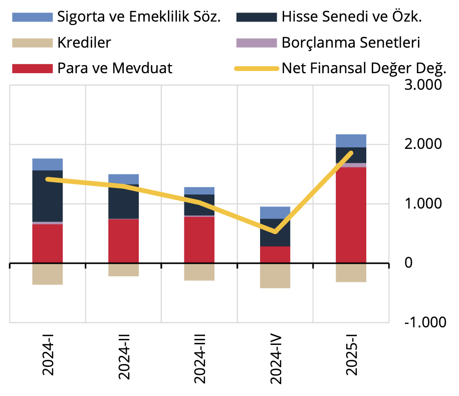
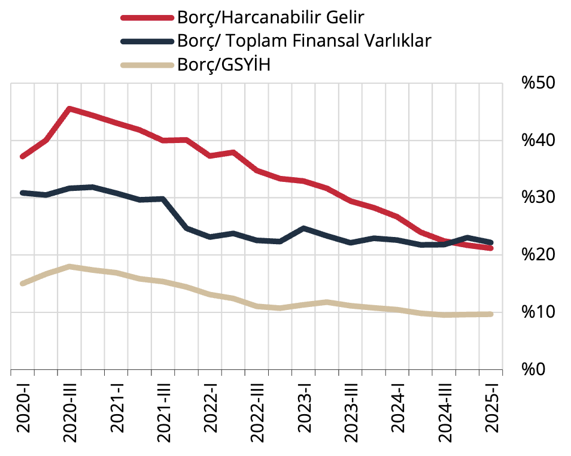

VI. Hanehalkı

Hanehalkı finansal varlıkları 2025 yılı birinci çeyreklik döneminde bir önceki döneme göre 2.236 milyar TL artış
göstererek 20.351 milyar TL düzeyine yükselmiştir (Grafik 24). İki çeyrek arasındaki artışın 1.443 milyar TL’si
işlem, 792 milyar TL’si ise değerleme kaynaklıdır. Mevduatlarda 1.237 milyar TL tutarında işlem kaynaklı artış
gerçekleşirken, kur kaynaklı 376 milyar TL değerleme bulunmaktadır (Grafik 25).

Grafik 24: Finansal Varlıkların Araç Dağılımı,
Stok (%)

Kaynak: TCMB

Grafik 25: Finansal Varlıklar, Akım (Milyar TL)

Kaynak: TCMB

Hanehalkı yükümlülükleri aynı dönemde bir önceki döneme göre 379 milyar TL artış göstermiş, bu artışın
tamamına yakını işlem kaynaklı olarak gerçekleşmiştir. Sonuç olarak sektörün net finansal pozisyonu, 2025
yılı birinci çeyreğinde para ve mevduatlar, hisse senedi ve özkaynaklar, borçlanma senetleri ile sigorta ve
emeklilik sözlemlerindeki artış kaynaklı 1.857 milyar TL artış göstermiştir (Grafik 26). Hanehalkı borçluluğuna
ilişkin göstergelere bakıldığında; hanehalkı borcunun GSYİH’ye oranı (%9,7) yatay seyrederken, borcun toplam
finansal varlıklara oranı (%22) ile borcun harcanabilir gelire oranı ise %21 ile sınırlı azalmıştır (Grafik 27).

Grafik 26: Hanehalkı Net Finansal Pozisyon
Değişimi (Milyar TL)

Kaynak: TCMB

Grafik 27: Hanehalkı Borcu (%)

Kaynak: TCMB, TÜİK