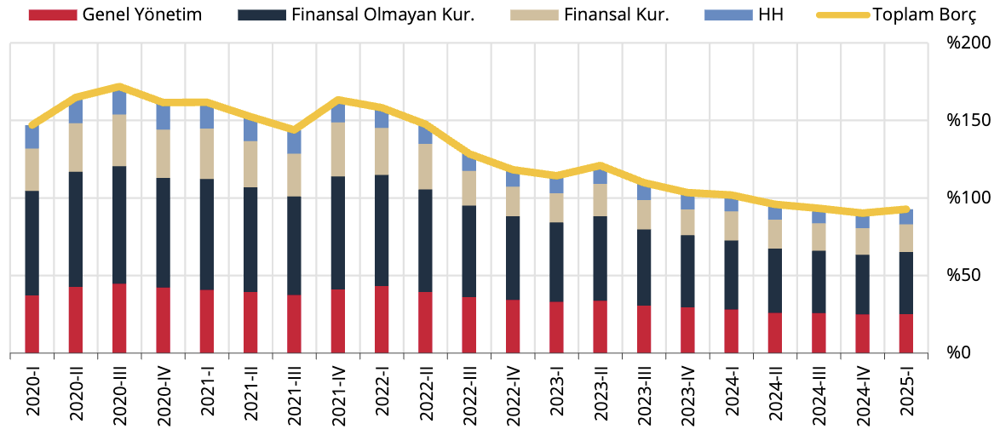
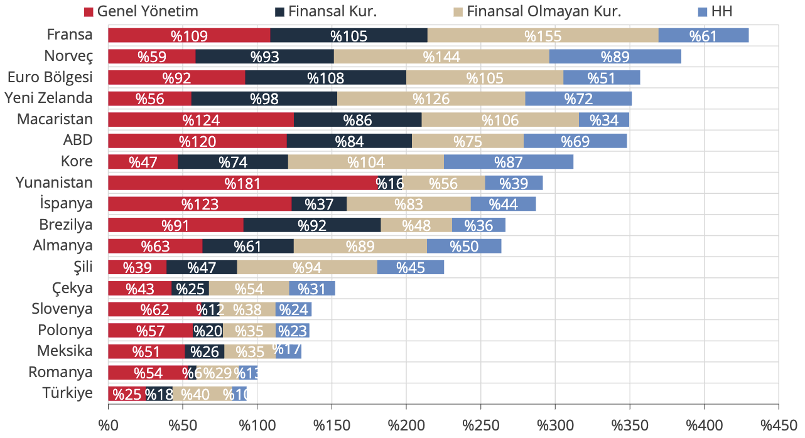

VIII. Borçluluk Oranları ve Ülke Karşılaştırmaları

Yurt içinde yerleşik sektörlerin kullandıkları krediler ve ihraç ettikleri borçlanma senetlerinin toplamından
oluşan finansal hesaplar tanımlı toplam borcun GSYİH’ye oranı, 2025 yılı birinci çeyreğinde sınırlı artarak %93
seviyesinde gerçekleşmiştir (Grafik 31).

Grafik 31: Sektörlerin Toplam Borcu/GSYİH* (%)

Kaynak: TCMB, TÜİK

(*) Borçlar; krediler ve borçlanma senetlerinden oluşmaktadır.

Tüm sektörlerin borçluluk oranları diğer ülkeler ile karşılaştırıldığında; 2025 yılı birinci çeyreği itibarıyla
Türkiye’de yerleşik sektörlerin toplam borcunun düşük seviyede gerçekleştiği görülmektedir (Grafik 32).

Grafik 32: Borç/GSYİH Ülke Karşılaştırması, Sektörler İtibarıyla* (%)

Kaynak: TCMB, TÜİK, OECD

Son Gözlem:2025-I

(*) Borçlar; krediler ve borçlanma senetlerinden oluşmaktadır.
Dipnot: Diğer ülke verileri 2024 IV. Çeyrek itibarıyladır.