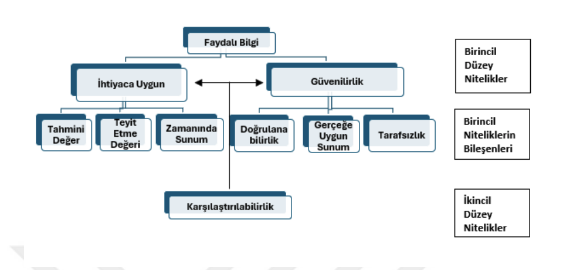

Şekil 1. FASB’nun Kabul Ettiği Faydalı Bilginin Özellikleri

Kaynak: (FASB, 1980)
Finansal bilgilerin bazıları diğer finansal bilgilerden daha yararlıdır. Örneğin,
bir işletmeyi başka bir işletme ile anlamlı bir şekilde karşılaştırabilecek bilgi, tamamen
farklı esaslara göre hazırlanmış bilgilerden daha yararlı olacaktır. Ayrıca gerçeklerle
desteklenen bilgiler, tahminlere dayalı olanlardan daha güvenilirdir. Dolayısıyla
karşılaştırılabilir, doğrulanabilir, zamanda ve anlaşılır bilgiler, ilgili ve gerçeğe uygun
olarak sunulan finansal bilgilerin yararlılığını artıracaktır (Maynard, 2017).
Son 30 yıldır ülkelerin birbirleri arasında ortak bir muhasebe dili oluşturmak
için uluslararası muhasebe standartları belirlenmiş, Türkiye’de belirlenen bu
standartlara uyum için çalışmalara yapmıştır. Türkiye Muhasebe Standartları Kurumu
(TMSK) kurulduktan sonra başta borsada işlem gören şirketler, aracılık faaliyetinde
bulunan kurumlar ve portföy yönetim firmaları, 2006 yılından sonra bankalar, finansal
kiralama firmaları, sigorta ve emeklilik şirketleri yükümlü tutulmuştur. 2011 yılında
Yeni Türk Ticaret Kanun’u yürürlüğe konulmasıyla birlikte Kamu Gözetimi Kurumu
kurulmuş ve TMSK’nın tüm yetkileri bu kuruma aktarılmıştır. 1 Haziran 2013
tarihinden itibaren tüm kamu kurum ve kuruluşları uluslararası muhasebe
standartlarını uygulamakla yükümlü kılınmıştır (Yatbaz & Gökbunar, 2019).